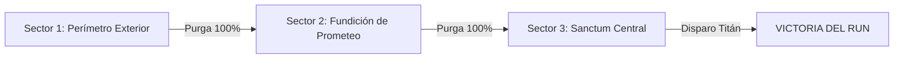
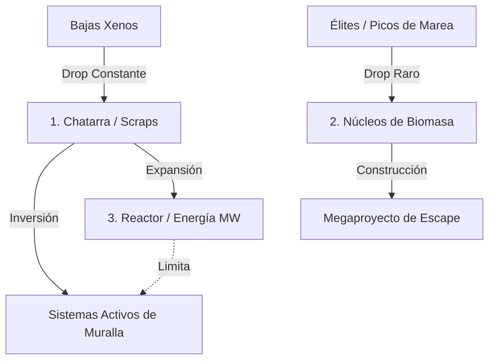

# DESIGN.md - Especificación de Diseño Canónico: TowerDS (Nintendo DS)

Documento canónico vivo de visión de juego, arquitectura de simulación balística, economía incremental, sistema de muralla modular y registro de decisiones para **TowerDS** en Nintendo DS.

---

## Índice
1. [Visión General, Género y Loop Core](#1-visión-general-género-y-loop-core)
2. [Arquitectura Espacial y Topología de Pantallas](#2-arquitectura-espacial-y-topología-de-pantallas)
3. [El Concepto de la Muralla Modular](#3-el-concepto-de-la-muralla-modular)
4. [La Ley de Escala y la Escalera de Automatización](#4-la-ley-de-escala-y-la-escalera-de-automatización)
5. [Estructura de Run y Megaproyecto de Escape](#5-estructura-de-run-y-megaproyecto-de-escape)
6. [Economía y Trinidad de Recursos](#6-economía-y-trinidad-de-recursos)
7. [Plantel Canónico de Amenazas Xenos](#7-plantel-canónico-de-amenazas-xenos)
8. [Sistema de Calibración en Hardware (`[CALIB]`)](#8-sistema-de-calibración-en-hardware-calib)
9. [Registro Vivo de Preguntas Abiertas (Open Questions)](#9-registro-vivo-de-preguntas-abiertas-open-questions)

---

## 1. Visión General, Género y Loop Core
- **Plataforma Objetivo:** Nintendo DS (Hardware físico con stylus y emulación determinista DeSmuME headless).
- **Género:** Arcade-Incremental Balístico / Clicker de Asedio y Fortificación (*Grimdark Dieselpunk*).
- **Ambientación:** Un Bastión perimetral del Adeptus Mechanicus bajo asedio implacable de un Enjambre Bio-Xenos.
- **Tasa de Refresco:** **60 FPS estables** en ARM9 sin caídas, con renderizado directo a VRAM (`VRAM_A` y sub-VRAM).
- **Core Loop de la Partida:**
  1. **Inicio Manual (Fricción Alta):** El jugador defiende a mano picando en la pantalla con el stylus (1 tap = 1 disparo, recolección manual de núcleos).
  2. **Escalado de Marea:** El volumen de enemigos crece exponencialmente; las tareas manuales se vuelven cuellos de botella físicos inasumibles.
  3. **Alivio por Automatización:** Inversión de Chatarra en mejoras que asumen las tareas manuales (ráfaga continua, auto-apuntado, succión de chatarra, servoreparación).
  4. **Financiamiento del Megaproyecto:** Con la base estabilizada, los recursos se desvían a construir el Megaproyecto de escape de la etapa.
  5. **Purga del Sector / Victoria de Etapa:** Al completar el 100% del Megaproyecto se detona la purga y se salta al siguiente sector con nuevas condiciones.

---

## 2. Arquitectura Espacial y Topología de Pantallas

### A. Campo de Batalla Vertical Continuo (256 × 384 px)
El campo de batalla abarca las dos pantallas físicas de la Nintendo DS como un lienzo vertical unificado:
- **Pantalla Superior ($Y \in [0..191]$):**
  - Zona de aproximación e incursión del enjambre xenos.
  - Spawns aleatorios en $Y=0$ con ancho horizontal $X \in [16..240]$.
  - HUD compacto de telemetría: progreso de la marea, porcentaje del Megaproyecto y estado del Reactor de Energía.
- **Pantalla Inferior / Táctil ($Y \in [192..383]$):**
  - Zona de combate directo e interacción con stylus.
  - El enjambre converge hacia el frente de asedio.
  - **Frontera de Impacto Infranqueable ($Y = 344$):** Labio superior de la Muralla. Los enemigos no pueden descender más allá; se anclan aquí e infligen daño directo por mordisco/ácido al blindaje.
  - **La Muralla Fortificada ($Y \in [344..383]$):** Estructura que ocupa todo el borde inferior de la pantalla táctil (40 px de altura).

---

## 3. El Concepto de la Muralla Modular

En lugar de obligar al jugador a microgestionar posiciones simétricas en un frente recto, la base es una **Muralla Fortificada Única y Continua**:
- **Un Solo Ente Defensivo:** La Muralla tiene una barra de integridad global (`wall_hp`).
- **Mejoras Visuales Integradas:** Conforme se compran cañones pesados, bobinas Tesla, lanzallamas o blindaje reforzado, el sprite y los detalles de la muralla evolucionan estéticamente (de trinchera de sacos de arena a fortaleza brutalista de acero y alta tensión).
- **Defensas de Campo Desplegables (Opcionales / Temporales):**
  - Elementos que se pueden plantar en medio del asfalto con el stylus (barricadas de púas, minas balísticas o perforadoras de núcleos).
  - Tienen vida limitada y los enemigos pueden atacarlos y destruirlos mientras avanzan hacia la muralla.

---

## 4. La Ley de Escala y la Escalera de Automatización

Inspirado en la filosofía de diseño de *Factorio*: **"Una tarea que al principio es esporádica y divertida, al escalar el juego 20x se convierte en una molestia física insoportable que suplica automatización."**

| Nivel de Fricción | Tarea Manual (Stylus) | Cuello de Botella por Escala | Mejora de Automatización | Sensación del Jugador |
| :---: | :--- | :--- | :--- | :--- |
| **Fase 1: Disparo** | `1 Tap = 1 Disparo` | 50 bichos/min: fatiga muscular extrema en muñeca. | **Gatillo Neumático:** Mantener pulsado (`Hold`) dispara continuo a máxima cadencia. | *"Dejo de aporrear la consola."* |
| **Fase 2: Foco** | Apuntar manualmente a cada amenaza prioritaria. | Mezcla de tanques con enjambre: balas desperdiciadas. | **Cogitador Balístico:** Auto-adquisición del más cercano/peligroso con override táctil. | *"La muralla se defiende sola."* |
| **Fase 3: Looting** | Tocar cada Núcleo/Chatarra antes de que caduque (6s). | Mueren 100 bichos/min: pantalla saturada de drops. | **Recolector Magnético / Servocráneos:** Absorción automática en radio creciente. | *"El dinero entra solo a la caja."* |
| **Fase 4: Daño** | Frotar la muralla para extinguir fuegos y soldar brechas. | Múltiples brechas simultáneas drenan la vida máxima. | **Servomantenimiento:** Reparación pasiva de HP/s y extinción automática. | *"Fortaleza indestructible."* |

---

## 5. Estructura de Run y Megaproyecto de Escape

Una partida completa no es infinita; es una **Campaña de Evacuación de 3 Sectores** (estilo *Hades* / *FTL*). Perder la muralla en cualquier sector reinicia la run.



- **Marea Continua:** No hay pausas artificiales ni oleadas discretas con relojes muertos. El flujo de xenos es ininterrumpido con picos de intensidad periódicos ("¡ALERTA DE BRECHA!").
- **Condición de Victoria de Sector:** Financiar el 100% de las fases del Megaproyecto local.
  - Cada fase del proyecto (25%, 50%, 75%) desencadena un pico masivo de asedio.
  - Al alcanzar el 100%, el proyecto se activa (sobrecarga térmica, bombardeo orbital o disparo del Cañón Titán), barriendo la pantalla y habilitando el paso al siguiente sector.

---

## 6. Economía y Trinidad de Recursos

Para garantizar profundidad estratégica sin sobrecargar la pantalla ni la memoria de la DS, la economía se sostiene en tres pilares:



1. **Chatarra (Scrap - Moneda Táctica):** Gasto recurrente. Compra mejoras de muralla, cadencia, imanes de loot y consumibles.
2. **Energía (Grid / MW - Factor de Minmaxing):** Límite pasivo de capacidad del reactor del búnker. Cada arma o sistema activo consume megavatios. Exceder la capacidad penaliza la cadencia o sobrecalienta el sistema, obligando a balancear armamento vs. generadores.
3. **Núcleos de Biomasa (Cores - Moneda de Victoria):** Se obtienen exclusivamente de amenazas pesadas/jefes. Se invierten en la construcción de las fases del Megaproyecto y en tecnologías permanentes entre runs.

---

## 7. Plantel Canónico de Amenazas Xenos

Ocho especies canónicas con siluetas, comportamientos y paletas estrictas:

| ID | Especie | Rol Táctico | Dimensiones | Comportamiento | Stats Base (HP / Scrap) |
| :---: | :--- | :--- | :---: | :--- | :--- |
| **0** | **Scourge** | Volador Kamikaze veloz | $31 \times 27$ px | Hostigador ultrarrápido con sombra dinámica | 18 HP \| 4 Chatarra |
| **1** | **Zergling** | Vanguardia en masa | $40 \times 39$ px | Corredor ágil en enjambre, ataque doble | 25 HP \| 5 Chatarra |
| **2** | **Hydralisk** | Asalto medio a distancia | $42 \times 55$ px | Infantería pesada erecta, andanadas de bio-espinas | 75 HP \| 15 Chatarra |
| **3** | **Mutalisk** | Cazador alado de flanco | $64 \times 72$ px | Planeador ágil a cota superior con sombra proyectada | 160 HP \| 35 Chatarra |
| **4** | **Defiler** | Caster biológico / Debilitador | $69 \times 59$ px | Gran resistencia, dispersa miasma que protege al enjambre | 320 HP \| 70 Chatarra |
| **5** | **Lurker** | Ariete acorazado con espinas | $69 \times 64$ px | Rompe-líneas blindado de alta absorción de daño | 500 HP \| 120 Chatarra |
| **6** | **Guardian** | Bombardero pesado de asedio | $78 \times 70$ px | Silueta colosal aérea, asedia a distancia extrema | 1.100 HP \| 250 Chatarra |
| **7** | **Ultralisk** | Titán Coloso / Boss | $98 \times 105$ px | Apisonadora biológica con hojas Kaiser oscilantes | 2.600 HP \| 600 Chatarra |

### Regla Canónica de Exclusividad Cromática Xenos
- La gama **púrpura / violeta / magenta** (`RGB 115, 35, 155` a `RGB 240, 150, 255`) y el blanco hueso quedan **estrictamente reservados para el enjambre xenos**.
- Prohibido emplear tonos púrpuras en el suelo metálico, muros o maquinaria imperial, garantizando lectura limpia figura-fondo.

---

## 8. Sistema de Calibración en Hardware (`[CALIB]`)
- Accesible en preparación mediante el botón táctil `[CALIB]`.
- 4 páginas de calibración a 32 filas cada una (Spawn Rates, Stats de Enemigos, Muralla y Parámetros de Forja).
- Persistencia binaria inmediata en MicroSD mediante `fat:/towerds_balance.bin`.
- Botones táctiles `[DEFAULTS]` para restaurar valores de fábrica y `[RESTART W1]` para reiniciar run al instante.

---

## 9. Registro Vivo de Preguntas Abiertas (Open Questions)

Este registro sustituye el debate efímero en el chat. Cada pregunta se actualiza aquí con su estado y consenso.

```
Leyenda de Estados:
- [ABIERTO]: En análisis preliminar.
- [PROPUESTA]: Solución concreta planteada pendiente de validación.
- [DECIDIDO]: Consensuado y listo para especificación técnica / implementación.
```

### `[OQ-01]` La Muralla Modular: ¿Unificación total o Bahías de Cañón?
- **Estado:** `[DECIDIDO]`
- **Decisión:** Muralla fortificada continua unificada en el borde inferior ($Y=344..383$). No se dividirá en 4 bahías simétricas porque el frente es plano y homogéneo; las mejoras son globales/integradas en la muralla. Se permite desplegar defensas de campo temporales destructibles en el asfalto (minas, barricadas, perforadoras).

### `[OQ-02]` Escalera de Automatización del Disparo
- **Estado:** `[DECIDIDO]`
- **Decisión:** 
  1. Nivel 0: Tap manual (1 tap = 1 disparo, limitado por cadencia).
  2. Nivel 1: Hold continuo (mantener stylus presionado = ráfaga continua).
  3. Nivel 2: Auto-target básico (disparo autónomo al más cercano).
  4. Nivel 3: Auto-target con override manual táctil (tocar un bicho fija objetivo prioritario).

### `[OQ-03]` Marea Continua vs. Oleadas Discretas
- **Estado:** `[DECIDIDO]`
- **Decisión (Modelo C - Marea Pautada con Picos de Alarma):**
  1. **Marea de Fondo Ininterrumpida:** Flujo base constante de xenos ligeros que garantiza un goteo continuo de chatarra (ingresos incrementales perpetuos sin tiempos muertos).
  2. **Picos de Alarma ("¡BRECHA DETECTADA!"):** Momentos de máxima tensión que triplican el spawn durante 30-45 segundos con tanques y élites. Se disparan por cronómetro de sector o al avanzar una fase del Megaproyecto.
  3. **Pausa Táctica en Tienda / Mejoras:** Al abrir el panel de mejoras o investigación, la simulación de combate se pausa por completo. Esto elimina la ansiedad de ser devorado mientras se analiza el árbol técnico y otorga al jugador un descanso físico natural para la mano y el stylus.

### `[OQ-04]` Mecánica del Recurso de Energía (Grid / Reactor)
- **Estado:** `[ABIERTO]`
- **Dilema:** ¿Qué ocurre exactamente cuando el consumo de la muralla supera la capacidad del reactor?
  - *Alternativa 1:* Las armas reducen proporcionalmente su cadencia de fuego (brownout).
  - *Alternativa 2:* Se apagan los subsistemas de menor prioridad (ej. primero se apagan los imanes de loot, luego las armas secundarias).
  - *Alternativa 3:* Hard Cap limpio (no se permite comprar ni activar una mejora si no hay MW libres en el reactor).

### `[OQ-05]` Adquisición y Activación de Consumibles ("Botones de Emergencia")
- **Estado:** `[ABIERTO]`
- **Dilema:** ¿Cómo obtiene el jugador los consumibles (bombardeo, pulso PEM, sobrecarga) y cómo los ejecuta en la pantalla táctil?
  - *Alternativa 1:* Ranuras fijas en la barra inferior para arrastrar al campo de batalla con stylus.
  - *Alternativa 2:* Cajas de suministros paracaidistas que caen en el campo de batalla y deben abrirse con un tap antes de ser destruidas.
