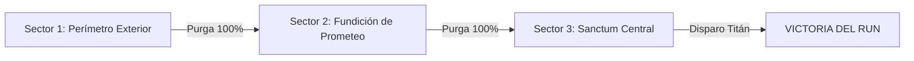
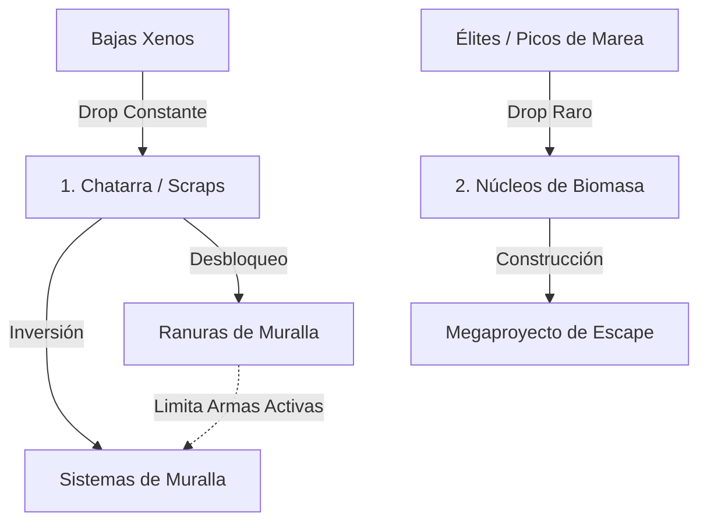

# DESIGN.md - Especificación de Diseño Canónico: TowerDS (Nintendo DS)

Documento canónico vivo de visión de juego, arquitectura de simulación balística, economía incremental, sistema de muralla modular y registro de decisiones para **TowerDS** en Nintendo DS.

---

## Índice
1. [Visión General, Género y Loop Core](#1-visión-general-género-y-loop-core)
2. [Arquitectura Espacial y Topología de Pantallas](#2-arquitectura-espacial-y-topología-de-pantallas)
3. [El Concepto de la Muralla Modular](#3-el-concepto-de-la-muralla-modular)
4. [La Ley de Escala y la Escalera de Automatización](#4-la-ley-de-escala-y-la-escalera-de-automatización)
5. [Estructura de Run y Megaproyecto de Escape](#5-estructura-de-run-y-megaproyecto-de-escape)
6. [Economía y Trinidad de Recursos](#6-economía-y-trinidad-de-recursos)
7. [Plantel Canónico de Amenazas Xenos](#7-plantel-canónico-de-amenazas-xenos)
8. [Sistema de Calibración en Hardware (`[CALIB]`)](#8-sistema-de-calibración-en-hardware-calib)
9. [Hoja de Ruta de Fases de Desarrollo (De la Fricción al Megaproyecto)](#9-hoja-de-ruta-de-fases-de-desarrollo-de-la-fricción-al-megaproyecto)
10. [Registro Vivo de Preguntas Abiertas (Open Questions)](#10-registro-vivo-de-preguntas-abiertas-open-questions)
11. [Lenguaje Visual Canónico y Assets](#11-lenguaje-visual-canónico-y-assets)

---

## 1. Visión General, Género y Loop Core
- **Plataforma Objetivo:** Nintendo DS (Hardware físico con stylus y emulación determinista DeSmuME headless).
- **Género:** City Defense Incremental Balístico / Clicker de Asedio y Automatización (*Grimdark Dieselpunk*).
- **Ambientación:** Un Bastión perimetral del Adeptus Mechanicus bajo asedio implacable de un Enjambre Bio-Xenos atraído a voluntad.
- **Tasa de Refresco:** **60 FPS estables** en ARM9 sin caídas, con renderizado directo a VRAM (`VRAM_A` y sub-VRAM).
- **Core Loop de la Partida (Sin Game Over clásico):**
  1. **Inicio Manual (Fricción Alta):** El jugador defiende a mano picando en la pantalla con el stylus (1 tap = 1 disparo a cualquier punto del campo inferior; tocar la silueta de un enemigo lo fija como objetivo perseguido). La base comienza como un mero armazón de andamiaje permeable.
  2. **Economía de Chatarra y Vetas:** Cada baja aporta Chatarra para desbloquear la escalera de 7 automatizaciones (A1 a A7) y financiar infraestructura minera sobre vetas.
  3. **Generador Aditivo de 7 Tiers:** Cada mejora principal de automatización erige un tier físico del Generador con sus propias 5 bombillas catódicas de vida.
  4. **Degradación en vez de Muerte:** Si los enemigos superan la defensa y destruyen tiers del Generador, la partida **NO termina en Game Over**: se degradan temporalmente las automatizaciones de los tiers dañados hasta ser reparadas.
  5. **Regulación por el Atraedor:** El jugador controla mediante dial continuo la intensidad del enjambre (tasa de spawn continua y tier de biocastas) para maximizar ingresos sin colapsar el generador.

---

## 2. Arquitectura Espacial y Topología de Pantallas

### A. Campo de Batalla Vertical Continuo (256 × 384 px)
El campo de batalla abarca las dos pantallas físicas de la Nintendo DS como un lienzo vertical unificado:
- **Pantalla Superior ($Y \in [0..191]$):**
  - Zona de aproximación e incursión del enjambre xenos.
  - Spawns aleatorios continuos en $Y=0$ con ancho horizontal $X \in [16..240]$ dictados por la tasa continua del Atraedor.
  - HUD compacto de telemetría: estado del Generador (`GENERATOR: X/7 TIERS ACTIVE`), tasa del Atraedor y telemetría de rendimiento.
  - **Limpia de proyectiles/conos:** no se dibujan conos de sangre ni salpicaduras en la pantalla superior.
- **Pantalla Inferior / Táctil ($Y \in [192..383]$):**
  - Zona de combate directo e interacción con stylus.
  - El enjambre converge hacia el frente sur.
  - **Frontera del Andamio / Generador ($Y = 344$ / $Y_{\text{local}} = 144$):**
    - Si `built_tiers == 0`: el andamio es permeable; los enemigos cruzan por debajo de la estructura sin detenerse.
    - Con tiers erigidos (`built_tiers > 0`): los enemigos impactan la estructura e infligen daño al tier superior activo (5 HP / bombillas por tier).
  - **La Batería y Depósito de Munición ($Y \in [344..383]$):** Batería lógica única con 4 cúpulas visuales rotatorias, indicador unificado de munición sobre el depósito central ($X=128, Y=153$) y recarga diegética arrastrando desde el búnker ($X \in [110..146], Y \in [150..180]$).

---

## 3. El Concepto del Generador Aditivo y Andamiaje Permeable

En sustitución de una muralla fija tradicional con barra global de vida que destruye la partida:
- **Andamiaje Inicial Permeable:** Al comenzar, la base es solo un andamio de soporte sin módulos construidos. Los enemigos caminan por debajo del andamio sin provocar colisión de bloqueo ni fin de juego.
- **Construcción Aditiva de 7 Tiers:** Cada automatización erige físicamente un tier del Generador.
- **Degradación de Automatización:** Cada tier tiene 5 bombillas de cátodo verde. Al recibir 5 impactos, el tier colapsa y desactiva su automatización asociada, exigiendo reparación con chatarra.
- **Batería Defensiva Coordinada:** La defensa consta de 1 torreta lógica metrónomo repartida en 4 cúpulas de artillería que rotan disparo balístico estético, con un solo cargador de batería compartido.

---

## 4. La Ley de Escala y la Escalera de Automatización

Inspirado en la filosofía de diseño de *Factorio*: **"Una tarea que al principio es esporádica y divertida, al escalar el juego 20x se convierte en una molestia física insoportable que suplica automatización."**

| Nivel de Fricción | Tarea Manual (Stylus) | Cuello de Botella por Escala | Mejora de Automatización | Sensación del Jugador |
| :---: | :--- | :--- | :--- | :--- |
| **Fase 1: Disparo** | `1 Tap = 1 Disparo` | 50 bichos/min: fatiga muscular extrema en muñeca. | **Gatillo Neumático:** Mantener pulsado (`Hold`) dispara continuo a máxima cadencia. | *"Dejo de aporrear la consola."* |
| **Fase 2: Foco** | Apuntar manualmente a cada amenaza prioritaria. | Mezcla de tanques con enjambre: balas desperdiciadas. | **Cogitador Balístico:** Auto-adquisición del más cercano/peligroso con override táctil. | *"La muralla se defiende sola."* |
| **Fase 3: Looting** | Tocar cada Núcleo/Chatarra antes de que caduque (6s). | Mueren 100 bichos/min: pantalla saturada de drops. | **Recolector Magnético / Servocráneos:** Absorción automática en radio creciente. | *"El dinero entra solo a la caja."* |
| **Fase 4: Daño** | Frotar la muralla para extinguir fuegos y soldar brechas. | Múltiples brechas simultáneas drenan la vida máxima. | **Servomantenimiento:** Reparación pasiva de HP/s y extinción automática. | *"Fortaleza indestructible."* |

### A. Techo Biomecánico y Estándar de Balance (Nintendo DS)
- **Axioma de Fatiga:** La pantalla táctil resistiva de la DS limita la cadencia humana precisa y cómoda a **2 a 3 pulsaciones por segundo ($2.0 - 3.0\text{ taps/s}$)**.
- **Regla Inviolable de Balance:** Ninguna horda o etapa sin automatización debe exigir más de $3.0\text{ taps/s}$. Si un pico supera ese valor, debe ser resoluble adquiriendo mejoras de Daño (reducción de balas por baja) o Automatización temprana (*Gatillo Continuo / Hold*).
- **Documento Canónico de Referencia:** Ver [`docs/BALANCE_DATA.md`](docs/BALANCE_DATA.md) para el desglose matemático formal de presupuestos de Chatarra, demandas de DPS y la tasa de pulsaciones requerida.

---

## 5. Estructura de Run y Megaproyecto de Escape

Una partida completa no es infinita; es una **Campaña de Evacuación de 3 Sectores** (estilo *Hades* / *FTL*). Perder la muralla en cualquier sector reinicia la run.


```mermaid
graph LR
    S1[Sector 1: Perímetro Exterior] -->|Purga 100%| S2[Sector 2: Fundición de Prometeo]
    S2 -->|Purga 100%| S3[Sector 3: Sanctum Central]
    S3 -->|Disparo Titán| WIN[VICTORIA DEL RUN]
```

- **Marea Continua:** No hay pausas artificiales ni oleadas discretas con relojes muertos. El flujo de xenos es ininterrumpido con picos de intensidad periódicos ("¡ALERTA DE BRECHA!").
- **Condición de Victoria de Sector:** Financiar el 100% de las fases del Megaproyecto local.
  - Cada fase del proyecto (25%, 50%, 75%) desencadena un pico masivo de asedio.
  - Al alcanzar el 100%, el proyecto se activa (sobrecarga térmica, bombardeo orbital o disparo del Cañón Titán), barriendo la pantalla y habilitando el paso al siguiente sector.

---

## 6. Economía y Trinidad de Recursos

Para garantizar profundidad estratégica sin sobrecargar la pantalla ni la memoria de la DS, la economía se sostiene en dos pilares de combate más el progreso de escape:


```mermaid
graph TD
    Kill[Bajas Xenos] -->|Drop Constante| Scrap[1. Chatarra / Scraps]
    Elites[Élites / Picos de Marea] -->|Drop Raro| Cores[2. Núcleos de Biomasa]
    Slots[Ranuras de Muralla] -.->|Limita Armas Activas| BaseUpgrades[Sistemas de Muralla]

    Scrap -->|Inversión| BaseUpgrades
    Scrap -->|Desbloqueo| Slots
    Cores -->|Construcción| Project[Megaproyecto de Escape]
```

1. **Chatarra (Scrap - Moneda Táctica):** Gasto recurrente. Compra mejoras de muralla, cadencia, imanes de loot y consumibles.
2. **Ranuras de Muralla (Sockets Físicos):** Limitador tangible de armas activas simultáneas en lugar de energía abstracta.
3. **Núcleos de Biomasa (Cores - Moneda de Victoria):** Se obtienen exclusivamente de amenazas pesadas/jefes. Se invierten en la construcción de las fases del Megaproyecto y en tecnologías permanentes entre runs.

---

## 7. Plantel Canónico de Amenazas Xenos

Ocho especies canónicas con siluetas, comportamientos y paletas estrictas, agrupadas en cuatro tiers de amenaza (dos especies por tier):

| ID | Tier | Especie | Rol Táctico | Dimensiones | Comportamiento | Stats Base (HP / Scrap) |
| :---: | :---: | :--- | :--- | :---: | :--- | :--- |
| **0** | **T1** | **Scourge** | Volador Kamikaze veloz | $31 \times 27$ px | Hostigador ultrarrápido con sombra dinámica | 1 HP \| 4 Chatarra |
| **1** | **T1** | **Zergling** | Vanguardia en masa | $40 \times 39$ px | Corredor ágil en enjambre, ataque doble | 3 HP \| 1 Chatarra |
| **2** | **T2** | **Hydralisk** | Asalto medio a distancia | $42 \times 55$ px | Infantería pesada erecta, andanadas de bio-espinas | 15 HP \| 15 Chatarra |
| **3** | **T2** | **Mutalisk** | Cazador alado de flanco | $64 \times 72$ px | Planeador ágil a cota superior con sombra proyectada | 5 HP \| 35 Chatarra |
| **4** | **T3** | **Defiler** | Caster biológico / Debilitador | $69 \times 59$ px | Gran resistencia, dispersa miasma que protege al enjambre | 45 HP \| 70 Chatarra |
| **5** | **T3** | **Lurker** | Ariete acorazado con espinas | $69 \times 64$ px | Rompe-líneas blindado de alta absorción de daño | 45 HP \| 70 Chatarra |
| **6** | **T4** | **Guardian** | Bombardero pesado de asedio | $78 \times 70$ px | Silueta colosal aérea, asedia a distancia extrema | 135 HP \| 250 Chatarra |
| **7** | **T4** | **Ultralisk** | Titán Coloso / Boss | $98 \times 105$ px | Apisonadora biológica con hojas Kaiser oscilantes | 135 HP \| 250 Chatarra |

### Regla de Tiers de Amenaza
- El **tier** (T1..T4) agrupa dos especies y marca su **nivel de amenaza**. El dial del Atraedor selecciona el tier (con interpolación fraccionaria, `[OQ-03]`); dentro del tier el enjambre alterna al azar entre sus dos especies.
- Los dos miembros de un tier comparten **HP base** (T1=3, T2=15, T3=45, T4=135). El **volador** del par desvía: es **más frágil** (⅓ de HP) y **más rápido** (×3 de velocidad), para seguir siendo amenaza por evasión en vez de por aguante (Scourge sobre Zergling; Mutalisk sobre Hydralisk).
- La **velocidad** y el **daño de mordisco** no son stats de tier: los fija la tabla maestra por variante (ver `TECHNICAL.md`). Los valores de scrap de T3/T4 son provisionales hasta su rebalanceo.

### Regla Canónica de Exclusividad Cromática Xenos
- La gama **púrpura / violeta / magenta** (`RGB 115, 35, 155` a `RGB 240, 150, 255`) y el blanco hueso quedan **estrictamente reservados para el enjambre xenos**.
- Prohibido emplear tonos púrpuras en el suelo metálico, muros o maquinaria imperial, garantizando lectura limpia figura-fondo.
- El **gore / sangre** usa una paleta **ROJA** (`COLOR_XENOS_GORE_*`: arterial → seca) y **nunca** púrpura, para que no se confunda con el enjambre. La **chitina** desprendida (fragmentos de coraza) sí conserva el púrpura xenos.

---

## 8. Sistema de Calibración en Hardware (`[CALIB]`)
- Accesible en preparación mediante el botón táctil `[CALIB]`.
- 4 páginas con scroll: `ATRAEDOR & GENERADOR`, `ENEMY STATS` (edita la tabla maestra: 8 especies × HP / Speed / Scrap / Bite Dmg / Bite Interval, con su tier mostrado), `BASE / STATS MEJORAS` y `COSTES TIENDA`.
- Persistencia binaria inmediata en MicroSD mediante `fat:/towerds_balance.bin` (magic `0x544F5737`, `"TOW7"`).
- Botones táctiles `[DEFAULTS]` para restaurar valores de fábrica y `[RESTART W1]` para reiniciar run al instante.

---

## 9. Hoja de Ruta de Fases de Desarrollo (De la Fricción al Megaproyecto)

Siguiendo el principio de desarrollo ágil e incremental (*"Find the fun first"*), el proyecto se estructura en tres fases evolutivas bien definidas. Nos centramos en clavar la jugabilidad de la **Fase 1** antes de programar la complejidad de las siguientes:

### A. Fase 1: "La Crisis del Gatillo" (Enfoque Inmediato - Prototipo Jugable)
* **Objetivo de Diseño:** Clavar las sensaciones del stylus, el impacto balístico y la primera gran victoria de automatización en Nintendo DS.
* **Mecánica Core:**
  1. **Muralla Modular en $Y=344$:** Bastión blindado único en el borde inferior con barra de vida propia (`wall_hp`).
  2. **Marea Continua:** Descenso frontal incesante desde la pantalla superior a la inferior (Zerglings y Scourges).
  3. **Disparo Manual Inicial:** `1 Tap = 1 Disparo` (fatiga física real con el stylus para defender la muralla).
  4. **Economía Base:** Cada baja otorga **Chatarra (Scrap)**.
  5. **La Escalera de Disparo:**
     - *Nivel 1:* Desbloqueo de **Gatillo Continuo (`Hold`)** para barrer la calzada a máxima cadencia.
     - *Nivel 2:* Desbloqueo de **Cogitador de Tiro (Auto-target)** al más cercano con override táctil a mano.
  6. **Tienda con Pausa Activa:** Al abrir el panel de mejoras, la simulación se congela para pensar, gastar chatarra y descansar la mano con calma.

### B. Fase 2: "La Crisis del Suelo y el Megaproyecto" (Diseño Consolidado para Siguiente Iteración)
* **Objetivo de Diseño:** Gestionar la consecuencia del éxito balístico a escala masiva y fijar la condición de victoria.
* **Mecánicas Planificadas:**
  1. **La Crisis del Botín:** Al matar a 100 bichos/minuto, el suelo se satura de chatarra y núcleos que desaparecen en 6 segundos si no se tocan con el stylus.
  2. **Automatización Logística:** Desbloqueo del **Recolector Magnético / Servocráneos barredores** de radio creciente.
  3. **Aparición de Élites y Núcleos de Biomasa:** Bichos acorazados pesados (Hydralisk, Lurker) que sueltan **Núcleos**.
  4. **El Megaproyecto de Escape:** La barra del Megaproyecto (0% $\to$ 100%) se financia exclusivamente con Núcleos. Cada fase alcanzada desata un pico de alarma ("¡BRECHA!").

### C. Fase 3: "La Crisis de Integridad y la Purga Titán" (Diseño Consolidado para Futura Iteración)
* **Objetivo de Diseño:** Tensión de asedio extremo, mantenimiento de brechas bajo fuego y el clímax de la run.
* **Mecánicas Planificadas:**
  1. **La Crisis de Mantenimiento:** Los golpes de bestias pesadas generan brechas e incendios en la muralla que drenan vida continua si no se reparan frotando con el stylus.
  2. **Automatización de Mantenimiento:** Servomantenimiento y soldadura pasiva de HP/segundo.
  3. **Consumibles de Emergencia ("Oh Shit!" buttons):** Bombardeo orbital, pulso PEM y sobrecarga de emergencia.
  4. **Disparo Titán:** Al alcanzar el 100% del Megaproyecto, se activa la superarma final, purga el sector y otorga la pantalla de victoria.

---

## 10. Registro Vivo de Preguntas Abiertas (Open Questions)

Este registro sustituye el debate efímero en el chat. Cada pregunta se actualiza aquí con su estado y consenso.

```
Leyenda de Estados:
- [ABIERTO]: En análisis preliminar.
- [PROPUESTA]: Solución concreta planteada pendiente de validación.
- [DECIDIDO]: Consensuado y listo para especificación técnica / implementación.
```

### `[OQ-01]` La Muralla vs. Generador Aditivo y Andamiaje Permeable
- **Estado:** `[DECIDIDO]`
- **Decisión:** Se descarta la muralla rígida con Game Over. La base arranca como un andamio permeable en $Y_{\text{local}}=144$. Si no hay tiers erigidos (`built_tiers == 0`), los enemigos cruzan por debajo. Conforme se compran las 7 mejoras clave (A1 a A7), se erigen físicamente los 7 tiers del Generador. El daño xenos destruye tiers individuales (5 HP cada uno) y degrada temporalmente las automatizaciones hasta ser reparadas.

### `[OQ-02]` Escalera de Automatización del Disparo
- **Estado:** `[DECIDIDO]`
- **Decisión:** 
  1. Nivel 0: Tap manual (1 tap = 1 disparo, limitado por cadencia).
  2. Nivel 1 (A1): Hold continuo (mantener stylus presionado = ráfaga continua). Erige Tier 1 del Generador.
  3. Nivel 2 (A2): Auto-target básico (disparo autónomo al más cercano). Erige Tier 2 del Generador.
  4. Nivel 3 (A3): Auto-target con override manual táctil (tocar un bicho fija objetivo prioritario).
  5. **Compuerta única del Hold:** el disparo continuo exige **comprar A1**; ninguna otra vía (reparar/erigir el Tier 1 por reparación diegética o calibración) lo desbloquea. Además es una automatización **degradable**: si el Tier 1 del Generador cae por daño, el Hold se desactiva (vuelve a tap manual) hasta repararlo.

### `[OQ-03]` Marea Continua Regulada por el Atraedor (Continuous Stream)
- **Estado:** `[DECIDIDO]`
- **Decisión:**
  1. **Dial Continuo del Atraedor:** En lugar de oleadas rígidas o temporizadores de asedio, el flujo es 100% continuo regulado por diales analógicos táctiles (tasa en enemigos/segundo y tier medio de biocastas).
  2. **Interpolación Fraccionaria de Spawn:** El acumulador de spawn corre en punto fijo Q8 (`budget += rate * dt`) para permitir tasas suaves (desde 0.25 hasta 20+ enemigos/s).
  3. **Composición Continua de Biocastas:** Tiers fraccionarios (ej. Tier 1.3 = 70% T1, 30% T2) que introducen orgánicamente nuevas especies sin escalones bruscos.
  4. **Pausa Táctica en Tienda / Menús:** Al abrir el panel de mejoras (`TIENDA`), la simulación de combate se pausa por completo para analizar compras y descansar el stylus.

### `[OQ-04]` Mecánica del Recurso y Economía (Chatarra + Vetas Mineras)
- **Estado:** `[DECIDIDO]`
- **Decisión:** Economía basada en Chatarra inmediata (bajas del enjambre) e infraestructura de minería en vetas de chatarra/mineral. Se descarta la energía pasiva por impuestos burocráticos.

### `[OQ-05]` Adquisición y Activación de Consumibles ("Botones de Emergencia")
- **Estado:** `[ABIERTO]`
- **Dilema:** ¿Cómo obtiene el jugador los consumibles (bombardeo, pulso PEM, sobrecarga) y cómo los ejecuta en la pantalla táctil?
  - *Alternativa 1:* Ranuras fijas en la barra inferior para arrastrar al campo de batalla con stylus.
  - *Alternativa 2:* Cajas de suministros paracaidistas que caen en el campo de batalla y deben abrirse con un tap antes de ser destruidas.

### `[OQ-06]` Balística Canónica, Metrónomo de Batería, Salud Virtual y Logística Táctil
- **Estado:** `[DECIDIDO]`
- **Decisión:**
  1. **La Muralla como Metrónomo Central:** Cadencia global unificada (`fire_interval`). Las 4 cúpulas de la batería rotan el fuego alternando cañones ($T_1 L \to T_2 L \to \dots$). Cada cúpula **conserva la última marcación a la que disparó** como postura de reposo cuando no hay objetivo (no vuelve a un ángulo fijo tras disparar); ver `[OQ-11]`.
  2. **Fuego Total en la Pantalla Inferior (Sin Rango):** Sin límite de alcance; el jugador y el auto-apuntado baten todo el campo táctil ($Y_{\text{local}} \in [0..143]$).
  3. **Salud Virtual Anti-Overkill (`incoming_damage`):** Se evita sobreaniquilación rastreando daño en vuelo.
  4. **Disparo Libre (revoca el antiguo «Filtro Táctil Estricto»):** El tap abre fuego hacia cualquier punto del campo táctil inferior, haya o no enemigo; **tocar suelo vacío también consume bala y cadencia**. El tap sobre la **silueta** de un enemigo lo fija como objetivo perseguido. La resolución táctil usa la **caja real del sprite** (con su `offset` y su cota de vuelo) unida a un radio de gracia de 24 px alrededor de su centro, y gana el enemigo más cercano. *(El antiguo filtro `[OQ-06].4` «prohibido disparar tocando suelo vacío» nunca llegó a implementarse; este punto lo revoca formalmente.)*
  5. **Logística Táctil de Munición:** Depósito único de munición en búnker ($X=128, Y=166$). Al vaciarse el cargador compartido (10 balas base), la batería entra en bloqueo y exige arrastrar el suministro con stylus a la línea defensiva.
  6. **Indicador de Integridad del Generador (35 Micro-Bombillas de Cátodo):** Eliminada la fila de 32 bombillas de muro. Cada una de las 7 bahías del Generador tiene 5 micro-bombillas de fósforo verde que parpadean en daño y se apagan al perder HP.
  7. **Descarte de Conos de Muerte:** Se suprimen los conos y salpicaduras angulares en pantalla superior e inferior (`DEATH_CONE_ENABLED = 0`); las bajas se representan por licuado gravitatorio local y desprendimiento de trozos reales de sprite en paleta roja.

### `[OQ-07]` Automatización Visual Cinética (Drones y Logística de Munición)
- **Estado:** `[DECIDIDO]` (Detalle en [`docs/SCALING_AND_AUTOMATION_IDEAS.md`](docs/SCALING_AND_AUTOMATION_IDEAS.md))
- **Decisión:** En Fase 2, la recarga manual con stylus se delega en un enjambre de drones/servocráneos visibles que vuelan entre el silo central y las torretas. Los cuellos de botella se perciben visualmente (torretas humeando a la espera de munición). Se simplifica la gestión a una única estadística canónica (*Rendimiento/Velocidad Logística de Drones*).

### `[OQ-08]` Escalado de Amenazas: Masa Volumétrica Real y Titanes vs. Variaciones Cosméticas
- **Estado:** `[DECIDIDO]` (Detalle en [`docs/SCALING_AND_AUTOMATION_IDEAS.md`](docs/SCALING_AND_AUTOMATION_IDEAS.md))
- **Decisión:** Se prohíben las escalas artificiales por mero cambio de paleta cromática. La escala se basa en:
  1. **Colosos Terrestres de Asalto:** Criaturas masivas (~1/3 de pantalla táctil, 64-80 px) con $\times 20$ a $\times 50$ HP que absorben fuego y poseen mecánicas de nodriza/desove continuo.
  2. **Titán Colosal en Pantalla Superior:** Asedio a dos pantallas en el clímax de la run, dañado mediante balística vertical que cruza la bisagra y superarmas del Megaproyecto.

### `[OQ-09]` Andamiaje Permeable y Progresión Física de Tiers
- **Estado:** `[PROPUESTA]`
- **Consenso en curso:**
  1. **Estado Inicial (Tier 0):** Al comenzar la partida o reinicio, la muralla no es una pared sólida sino un armazón esquelético/andamio. Los enemigos no se detienen en $Y_{\text{local}}=144$; simplemente pasan por debajo hacia el abismo sur sin causar daño ni Game Over, permitiendo al jugador familiarizarse con el tiro y el stylus.
  2. **Erección Física por Automatización:** Al comprar A1 (Hold-to-fire) se asienta el primer bloque físico con blindaje y sus 5 bombillas. A partir de ese momento, los enemigos sí colisionan y atacan ese bloque.
  3. **Visualización Progresiva:** Cada tier comprado (A1..A7) levanta una estructura vertical o bahía física visible, sustituyendo el andamio vacío por maquinaria activa del generador.

### `[OQ-10]` Control del Dial del Atraedor y Calibración de Flujo Base
- **Estado:** `[PROPUESTA]`
- **Consenso en curso:**
  1. **Tasa Base Inicial Lenta:** El dial arranca en un goteo suave ($0.5$ o incluso $0.25$ enemigos por segundo) en lugar de $2.0$/s, dando un ritmo contemplativo de clicker/incremental al inicio.
  2. **Interacción del Dial Analógico:** El jugador debe poder manipular el dial táctilmente arrastrando el stylus en ambos ejes (arriba/abajo o izquierda/derecha) con fricción analógica suave, permitiendo modular el flujo de ingresos y peligro de forma orgánica.
  3. **Visualización de Telemetría Superior:** Sustituir telemetría de depuración cruda (`GEN: [X0]...`) por lecturas de estado diegéticas y limpias (`GENERATOR: X/7 TIERS ACTIVE`, `ATTRACTOR: X.X/s`).
  4. **Granularidad de 0.05 y Autorepeat:** el dial (tasa de spawn $0.00..10.00$/s y tier $T1.00..T4.00$) avanza en pasos exactos de **$0.05$** por pulsación; mantener la cruceta pulsada acelera el avance (repetición con rampa). El HUD muestra **dos decimales** (`DIAL:X.XX/s`, `TIER:TX.XX`) para que el escalón de $0.05$ sea visible.

### `[OQ-11]` Postura de Reposo de la Batería (Apuntado Persistente)
- **Estado:** `[DECIDIDO]`
- **Decisión:** Cada cúpula de la batería **mantiene la dirección de su último disparo** como postura de reposo cuando no hay objetivo que batir; ya no vuelve a un ángulo fijo tras disparar. Mientras exista objetivo (auto-apuntado o fijado con el stylus) la cúpula apunta a él; al cesar, se queda en la última marcación. La postura inicial de fábrica de cada socket la define la tabla de sockets (`c_wall_sockets[].default_angle`), única fuente de verdad.

---

## 11. Lenguaje Visual Canónico y Assets

### A. Assets maestros de sprites
- El **asset maestro** canónico de cualquier entidad con animación (torretas, enemigos, etc.) es SIEMPRE la **cinta completa de animación** (`*_strip_master_1x.png`).
- Los **GIF** son exclusivamente **previsualización** para el usuario. Las hojas de propuestas exploratorias iniciales se archivan como referencia histórica.
- Al incorporar un sprite o tile nuevo se convierte al **array C** correspondiente, se compila la ROM y se captura con DeSmuME (proceso en `AGENTS.md`).

### B. Escenario de combate
- **Campo abierto (256 px):** el campo abarca el ancho completo de la pantalla, **sin carriles** ni calzadas estrechas de 32 px; el enjambre avanza libremente hacia el sur (§2).
- **Muralla defensiva:** anclada en la cota canónica `WALL_DEFAULT_Y` (**Y = 144** de la pantalla inferior), sirve de anclaje a las torretas activas y a la línea de defensa (§3).
- **Suelo isométrico 2:1** (`dx=2, dy=1`) con tiles maestros de 32×32 px (`assets/tiles/sector1/master/tile_061_cobblestone_1x.png`, `tile_062_irregular_1x.png`, `tile_063_flagstone_1x.png`), renderizados en modo bitmap / modo 5 paletizado con solapamiento *back-to-front*. Queda **prohibido** el uso de los tiles cenitales/ortogonales a 90° (archivados en `assets/tiles/sector1/archive/`).
- **Sin rango:** la muralla bate toda la pantalla inferior; el stylus dispara a cualquier punto de esa superficie y fija como objetivo al enemigo cuya **silueta** toca (hitbox = caja del sprite ∪ radio de gracia de 24 px, `[OQ-06].4`). Queda prohibida cualquier franja o línea de demarcación de alcance sobre el empedrado.