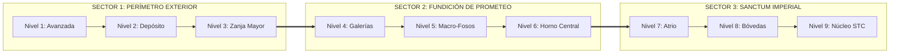
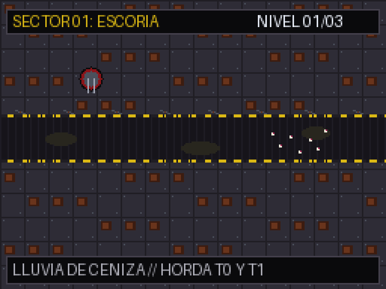
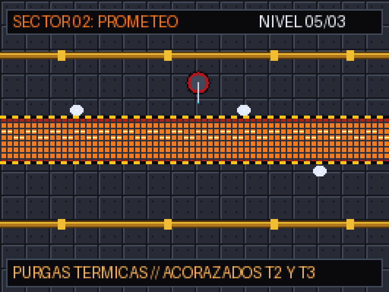
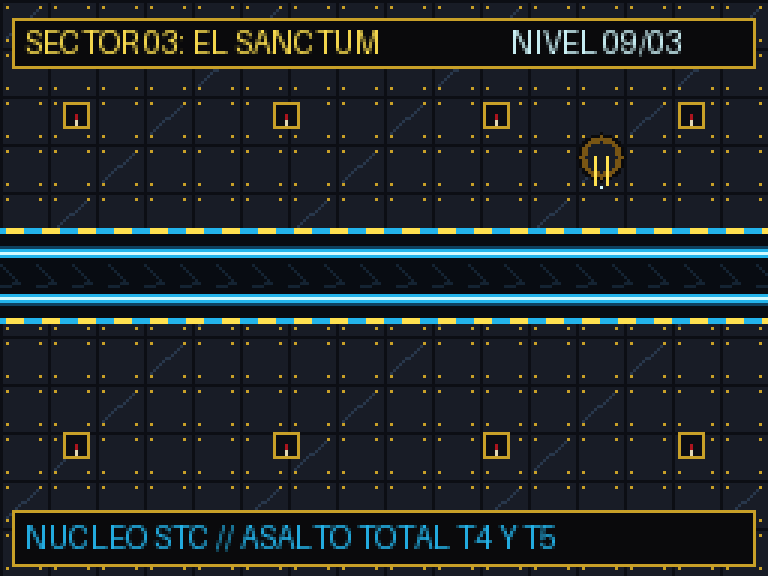

# SECTORS.md - Identidad y Especificación de los 3 Sectores de Campaña

Este documento define la ambientación narrativa, paleta gráfica, arquitectura de trincheras, mecánicas de entorno y composición de amenazas para los **3 Sectores (9 Niveles en total)** de una run de `towerds`.

---

## 1. Visión General de la Campaña: "La Gran Purga"

Una expedición de asedio consta de **3 Sectores consecutivos**, cada uno compuesto por **3 Niveles procedimentales** (9 mapas por run):

- **Integridad Global (20 Puntos del Núcleo):** Se comparte a lo largo de los 9 niveles. Cada fuga al final de la trinchera resta 1 punto. Si llega a 0, la run concluye.
- **Economía Incremental:** La chatarra ganada se reinvierte en el árbol técnico intra-run, cuyos efectos perduran durante toda la partida.

---

## 2. Sector 1: "Perímetro Exterior: Las Trincheras de Escoria" (Niveles 1 a 3)

### A. Ambientación & Paleta Gráfica
- **Entorno:** Las tierras baldías de ceniza volcánica y escoria industrial que rodean la ciudad colmena.
- **Paleta de Color:**
  - *Suelo exterior:* Grises cenicientos oscuros (`#201E24`, `#2E2C36`), parches de óxido profundo (`#69341C`) y remaches de acero desgastado (`#4B505C`).
  - *Trinchera:* Tierra excavada oscura (`#16141A`), chapas acanaladas de metal ondulado oxidado y charcos de fango cáustico verdoso-amarillento.
  - *Señalética:* Líneas de peligro amarillas desgastadas (`#DCB914`) y desconchadas por el polvo.
  - *Props de Decoración:* Rollos de alambre de espino perimetral, cajas de munición vacías y balizas de posición toscas.
- **Iluminación:** Luz diurna turbia y opaca filtrada por nubes de ceniza industrial en suspensión.

### B. Geometría de Trinchera & Táctica
- **Trazado:** Trincheras de 32 px con curvas suaves y amplias en "S". Una única boca de entrada y una boca de salida.
- **Emplazamientos:** Terreno llano y despejado, ideal para colocar múltiples baterías de tiro directo.
- **Peligro Ambiental:** **Lluvia de Ceniza (Ash Fall)**. A intervalos regulares, el viento levanta polvo cáustico que reduce un 15% el rango efectivo de las armas durante 6 segundos. Obliga al jugador a colocar las torretas cerca del canal.

### C. Composición del Enjambre & Escala
- **Nivel 1:** Hordas puras de **Tier 0 (Micro-Larvas Rastreras, 2x2 px)** a cientos. Aprendizaje del fuego continuo.
- **Nivel 2:** Mezcla masiva de **Tier 0** con incursiones rápidas de **Tier 1 (Rippers Devoradores, 6x4 px)**.
- **Nivel 3 (Fin de Sector):** Enjambres densos de T0/T1 respaldados por una vanguardia aérea de **Tier 2 (Gárgolas Bio-Scout, 9x9 px)** que sobrevuelan la trinchera a gran velocidad.
- **Meta Recomendado:** *Twin Heavy Bolter* (saturación pura) y *Heavy Flamer* en las curvas.

---

## 3. Sector 2: "Complejo de Fundición: Los Conductos de Prometeo" (Niveles 4 a 6)

### A. Ambientación & Paleta Gráfica
- **Entorno:** Las entrañas de las macro-forjas del Adeptus Mechanicus. Hornos de fundición de acero, tuberías a presión de combustible prometio y foso de metal fundido.
- **Paleta de Color:**
  - *Suelo exterior:* Rejillas de acero forjado azulado (`#14161C`, `#262A34`) con planchas antideslizantes de diamante.
  - *Tuberías:* Conductos macizos de latón y bronce pulido (`#5A3A10`, `#AF781C`, `#F0BE32`) con válvulas de purga.
  - *Trinchera:* Canal de fundición incandescente con magma líquido en el fondo (`#B41E0A`, `#FF7814`, `#FFF08C`) sobre el cual flota una pasarela suspendida de rejilla de hierro.
  - *Señalética:* Bordes de advertencia reflectantes y balizas parpadeantes de calor crítico.
  - *Props de Decoración:* Válvulas de vapor a presión con nubes de escape intermitentes y cables de alta tensión.
- **Iluminación:** Resplandor dinámico naranja-fuego proyectado desde abajo por el magma de la trinchera.

### B. Geometría de Trinchera & Táctica
- **Trazado:** Bifurcaciones en la trinchera (los enemigos pueden dividirse en 2 caminos paralelos que vuelven a unirse) y cuellos de botella estrechos.
- **Emplazamientos:** Espacio más reducido y compartimentado entre las tuberías de vapor.
- **Peligro Ambiental:** **Válvulas de Purga Térmica (Thermal Vents)**. Los conductos de vapor descargan calor residual en tramos marcados de la pasarela cada 25 segundos, quemando al enjambre si el jugador calcula bien el timing.

### C. Composición del Enjambre & Escala
- **Nivel 4:** Desembarco masivo de **Tier 2 (Gárgolas)** con los primeros contingentes de **Tier 3 (Ravener Serpiente, 14x10 px, 2 Armadura plana)**. Las armas ligeras comienzan a sufrir rebotes.
- **Nivel 5:** Oleadas mixtas con alta densidad de blindaje (Raveners respaldados por enjambre de Rippers que absorben daño).
- **Nivel 6 (Jefe del Sector 2):** Incursión del **Tier 4 (Haruspex Fauces Vivas, 20x20 px, 5 Armadura plana, 2.800 HP)**. Bestia demoledora que avanza devorando la trinchera.
- **Meta Recomendado:** Despliegue obligatorio de **Lascannons** (100% penetración de armadura) y *Heavy Flamers* para ablandar el caparazón.

---

## 4. Sector 3: "Sanctum Imperial: El Núcleo de Datos STC" (Niveles 7 a 9)

### A. Ambientación & Paleta Gráfica
- **Entorno:** Catedral-bóveda sagrada del Omnissiah donde reposan los servidores cuánticos y los archivos STC.
- **Paleta de Color:**
  - *Suelo exterior:* Losas de mármol negro obsidiana pulido (`#0C0E14`, `#181C26`) con vetas minerales azuladas y filigranas de oro imperial (`#785514`, `#C8A028`, `#FFE150`).
  - *Trinchera:* Conducto cilíndrico sellado de refrigeración criogénica con rieles superconductores electroluminiscentes en color cian brillante (`#0E415F`, `#23B4EB`, `#D2FAFF`).
  - *Señalética:* Sellos de pureza de cera carmesí (`#AA141E`) con pergaminos de juramento bendecidos (`#E1D7B4`) y glifos binarios sagrados en bronce.
  - *Props de Decoración:* Contrafuertes góticos con cráneos cibernéticos (Servo-cráneos), altares de control con monitores de fósforo verde y haces de cables de datos.
- **Iluminación:** Atmósfera gótica fría con haces de luz cian neón y sombras alargadas solemnes.

### B. Geometría de Trinchera & Táctica
- **Trazado:** Pasillos en ángulos rectos de 90° con 2 o 3 accesos convergentes directamente hacia el Núcleo Sagrado. Rutas más cortas: el tiempo de reacción es mínimo.
- **Emplazamientos:** Puntos de anclaje de alta concentración que permiten fuego cruzado concentrado.
- **Peligro Ambiental:** **Descarga de Arco Cuántico (Omnissiah's Wrath)**. El jugador dispone de un botón táctil de emergencia por nivel que descarga una sobretensión eléctrica en toda la pantalla, aturdiendo a todos los xenos durante 3 segundos.

### C. Composición del Enjambre & Escala
- **Nivel 7:** Oleadas a híper-velocidad de Gárgolas (T2) y Raveners (T3) que buscan romper las líneas defensivas.
- **Nivel 8:** Despliegue simultáneo de múltiples Haruspex (T4) empujando con escudos de biomasa viva.
- **Nivel 9 (Jefe Final Supremo de la Campaña):**
  - Aparición del **Tier 5: Bio-Titán Hierofante (28x28 px, 40.000 HP, 8 Armadura plana)**.
  - Ocupa prácticamente los 32 px de la trinchera, exhala nubes de esporas venenosas y dispara bio-cañones gemelos.
- **Meta Recomendado:** Máxima sinergia de build: Lascannons sobrecargados con penetración infinita, baterías de misiles guiados y soporte de ralentización criogénica.

---

## 5. Comparativa Visual de Sectores (Resolución DS)

| Dimensión | Sector 1: Escoria | Sector 2: Prometeo | Sector 3: Sanctum |
| :--- | :--- | :--- | :--- |
| **Material Suelo** | Placas de acero oxidado y ceniza | Rejillas industriales de fundición | Mármol obsidiana pulido y oro |
| **Fondo Trinchera** | Zanja de tierra y fango cáustico | Foso de magma y metal fundido | Canal de helio líquido cian neón |
| **Tono de Color** | Grises, marrones y óxido | Negros, bronces y naranja fuego | Negros profundos, oro y cian helado |
| **Nivel de Blindaje** | 0 Armadura (Horda vulnerable) | 2 a 5 Armadura (Blindados pesados) | 5 a 8+ Armadura (Bio-Titán) |
| **Ritmo de Juego** | Construcción de motor económico | Transición obligada a calibres AP | Supervivencia extrema y overclocking |
