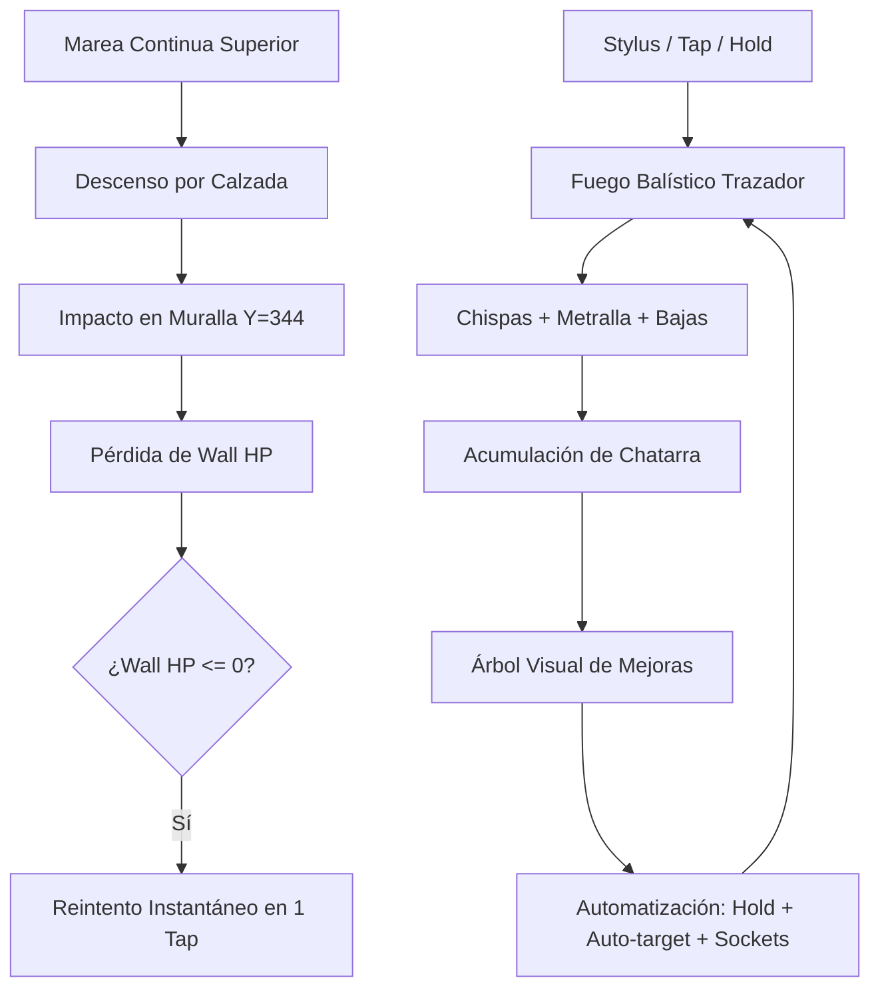

# PHASE 1 SPEC: "La Crisis del Gatillo" (Mínimo Jugable Incremental)

> **Objetivo de Diseño:** Clavar las sensaciones físicas del stylus en Nintendo DS, el peso y pirotecnia balística del fuego defensivo, la presión de la marea continua y la primera gran victoria de automatización mediante un árbol tecnológico visual.

---

## 1. Visión General del Prototipo

La Fase 1 establece el bucle jugable nuclear (*Core Loop*) en formato arcade incremental de asedio frontal:

---

## 2. Componentes Técnicos y de Diseño

### A. La Muralla, Sockets y Sistema Balístico
* **Geometría y Ubicación:**
  - Posicionada en la base de la pantalla táctil ($Y = 344..383$, altura de 40 px / 2.5 tiles).
  - Bastión blindado único con salud global (`wall_hp`).
  - Dividida en ranuras físicas (**Sockets**):
    - **Socket Central (Canónico inicial):** Aloja el cañón principal operado por el jugador.
    - **Sockets Laterales (Izquierdo / Derecho):** Desbloqueables para alojar torretas secundarias automáticas que barren sus respectivos carriles.
* **Sensación Táctil y Pirotecnia Balística:**
  - **Cadencia Base:** `1 Tap = 1 Disparo` (fatiga física deliberada).
  - **Trazadoras Incandescentes (Tracers):** Proyectiles veloces de alto contraste (amarillo/naranja tungsteno) que trazan líneas balísticas directas hacia el punto de contacto.
  - **Impacto y Metralla:** Sistema de chispas (`combat_sparks`) que eyecta 4-6 partículas de metralla brillante y salpicaduras de icor alienígena al golpear.
  - **Eyección de Casquillos (Casing Ejection):** Cada disparo eyecta un casquillo dorado hacia atrás con física parabólica que rebota en el suelo del búnker.
  - **Micro-temblor de Impacto (Screen-shake):** Offset de 1 px durante ráfagas o impactos directos en muralla para transmitir masa industrial.

### B. Marea Continua y Picos de Alerta
* **Flujo Frontal Continuo:**
  - Enjambre xenos (Zerglings terrestres y Scourges aéreos) descendiendo constantemente desde la pantalla superior ($Y=0$) cruzando la bisagra hacia la pantalla inferior ($Y=192$).
  - Sin cortes de pantalla ni pantallas de carga entre oleadas.
* **Picos de Alerta Máxima (Hordas Pautadas):**
  - Widget en pantalla superior: `ALERTA EN 0:15 - HORDA ESTIMADA: 40 ENJENDROS`.
  - Al expirar la cuenta atrás: destello de borde rojo + sirena visual $\to$ Desciende una cuña densa de enemigos en formación compacta.
* **Telemetría Superior:**
  - Contador de bajas totales.
  - Chatarra actual acumulada.
  - Cronómetro de supervivencia de la run.

### C. Árbol Visual de Tecnologías y Economía
* **Interfaz de Árbol (Visual Circuit / Tech Tree):**
  - Sustituye cualquier menú de lista plana por un grafo visual de nodos interconectados con pistas de cobre/tuberías.
  - Estados visuales por nodo: *Bloqueado*, *Comprable (iluminado)*, *Adquirido / Nivel actual*, *Masterizado (dorado)*.
  - **Pausa Táctica Total:** Al pulsar `[ÁRBOL / TIENDA]`, el combate se congela por completo para pensar, invertir chatarra y relajar la mano.
* **Las 6 Ramas del Árbol de Fase 1:**
  1. **Automatización:** *Gatillo Continuo (`Hold`)* $\to$ *Cogitador de Tiro (`Auto-target`)*.
  2. **Calibre (Daño):** Incremento de daño por impacto ($\times 1.25$ por nivel).
  3. **Refrigeración (Cadencia):** Reducción de cooldown entre disparos (+disparos/seg).
  4. **Expansión (Muralla):** *Desbloqueo Socket Izquierdo* $\to$ *Desbloqueo Socket Derecho*.
  5. **Reciclaje (Economía):** Incremento porcentual de chatarra obtenida por baja.
  6. **Integridad (Búnker):** +HP Máximo de la muralla y botón de reparación de emergencia.
* **Bucle de Game Over:**
  - Si `wall_hp == 0`: Pantalla de colapso con estadísticas de la run (tiempo resistido, bajas, chatarra producida) y botón táctil `[REINTENTAR]` (Soft Reset instantáneo).

---

## 3. Plan de Desarrollo en 3 Sesiones Atómicas

Siguiendo el protocolo estricto de `AGENTS.md` (un chat = una feature aislada en su propio git worktree):

| Sesión | Título / Feature | Alcance Principal | Entregable y Validación |
| :--- | :--- | :--- | :--- |
| **Sesión 1** | **Diseño e Impl. de la Muralla y Balística** | - Geometría de muralla en $Y=344$ con barra de HP. - Sockets (central activo, slots laterales). - Motor balístico táctil: Tap manual, trazadoras, chispas, casquillos. - Stats base de muralla y arma. | Build limpia + Escenario DeSmuME con muralla interactiva recibiendo taps y disparando pirotecnia. |
| **Sesión 2** | **Marea Continua y Picos de Alerta** | - Spawner de marea incesante (pantalla superior $\to$ inferior). - Temporizador de alerta con picos de horda compacta. - Telemetría y widget de aviso en pantalla superior. - Colisión de enemigos contra la muralla (`wall_hp` damage). | Build limpia + Escenario DeSmuME con oleada continua cruzando pantallas y dañando muralla. |
| **Sesión 3** | **Árbol Visual de Mejoras y Balance** | - Pantalla táctil del Árbol de Tecnologías con nodos visuales. - Pausa táctica al abrir tienda. - Lógica de las 6 ramas (Hold, Auto-target, Daño, Cadencia, Sockets, HP). - Bucle de Game Over / Reset instantáneo. - Balance matemático de la progresión para máxima diversión. | Build limpia + Escenario completo + Subida y prueba en consola Nintendo DS real (`towerdefense.nds`). |

---

## 4. Criterios de Aceptación para la Demo de Fase 1
1. **Sensación del Stylus:** Se siente inmediata y física la transición de fatiga (Tap) a alivio de poder (`Hold` y `Auto-target`).
2. **Impacto Visual:** Los disparos llenan la pantalla de trazadoras luminosas, casquillos saltando y chispas de impacto en los enemigos.
3. **Legibilidad del Árbol:** El jugador ve claramente el árbol con sus conexiones y siente el progreso tangible al comprar cada nodo.
4. **Rendimiento:** 60 FPS estables en Nintendo DS física sin glitches en OAM ni ralentizaciones.
