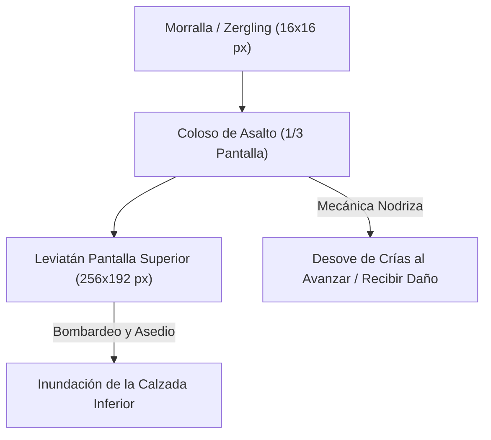

# Ideas de Diseño: Escalado Incremental, Enemigos Colosales y Automatización Visual

Documento de consolidación de diseño para el escalado del juego, la progresión entre fases y la evolución del bucle de interacción táctil a automatizado en Nintendo DS.

---

## 1. Filosofía de Automatización Visual: El Placer del "Hormiguero en Marcha"

En lugar de que la automatización vuelva el juego pasivo o abstracto, la transición de fases debe transformar la experiencia en un **espectáculo visual cinético**.

### A. La Escalera de Recarga y Logística
* **Fase Inicial (Manual):**
  - El jugador sube stats básicas: **Capacidad del Cargador** y **Cadencia de Disparo**.
  - La recarga se realiza obligatoriamente a mano con el stylus (o tap sobre la torreta/batería).
  - Cuello de botella: Cadencia alta con cargador pequeño exige recargar continuamente.
* **Fase de Automatización (Drones / Servocráneos):**
  - Se desbloquea la **Recarga Automática con Drones**.
  - **Física Visual Visible:** Drones o servocráneos vuelan físicamente en pantalla realizando el ciclo:
    $$\text{Silo Central de Munición} \longrightarrow \text{Torretas en la Muralla} \longrightarrow \text{Retorno al Silo}$$
  - **Cuello de Botella Evidente:** Si la cadencia de la torreta supera el flujo de los drones, la torreta se queda humeando con el cargador seco a la espera de que el dron aterrice con el tambor de balas. El jugador ve el problema con sus propios ojos, sin necesidad de leer hojas de cálculo.
* **Unificación de Estadísticas (Simplicidad Elegante):**
  - Para evitar microgestión artificial y no saturar la UI, se evita fragmentar la estadística de drones en múltiples parámetros (radio, carga útil, número de drones, aceleración).
  - **Stat Unificada:** *Velocidad / Rendimiento Logístico de Drones*. Cada nivel incrementa el flujo global de balas por segundo transportadas (haciendo que los drones vuelen más rápido y transporten mayor carga de forma paquetizada).

---

## 2. Escalado de Enemigos: Masa Real vs Variaciones Cosméticas

Quedan descartadas las subidas artificiales de vida mediante meros cambios de paleta de colores. La escala debe ser **volumétrica, diegética y reconocible de un vistazo**.

### A. Colosos Terrestres de Asalto (Ocupan ~1/3 de Pantalla)
* **Presencia Física:**
  - Enemigos terrestres de gran envergadura (30% a 35% del ancho de la pantalla táctil, aprox. $64\times 64$ a $80\times 80$ px).
  - Justifican de forma natural tener entre $\times 20$ y $\times 50$ la salud de un enemigo base.
  - Al recibir impactos, su masa tiembla y absorben disparos, actuando como escudo natural que protege al enjambre ligero que desciende tras ellos.
* **Mecánica Nodriza (Spawners / Portadores de Enjambre):**
  - Bestias pesadas que no solo avanzan, sino que **desovan crías continuamente** o revientan liberando una dispersión de unidades menores al morir.
  - Prioridad táctica: Destruirlos rápido corta el flujo incesante de morralla.

### B. El Titán de la Pantalla Superior (Uso de Dos Pantallas de la DS)
* **Concepto:**
  - Una mega-bestia colosal (Leviatán xenos / Reina Colmena) cuyo cuerpo ocupa la **pantalla superior completa**.
  - Resuelve el límite visual de la Nintendo DS: el jugador ve con sus propios ojos una criatura cientos de veces mayor que un bicho ordinario.
* **Resolución del Daño (Cómo atacarle):**
  Dado que la pantalla superior no es táctil y el stylus no puede picarle directamente:
  1. **Alcance y Ángulo Balístico:** Al disparar con el cañón apuntando hacia la parte superior de la pantalla táctil, las trazadoras cruzan la bisagra hacia la pantalla superior e impactan en la masa del titán.
  2. **Balizas de Designación Táctil:** Con el stylus se marca un señuelo/baliza en la muralla o en el borde superior de la táctil; las torretas automáticas o la artillería antiaérea elevan sus cañones y concentran fuego en el Titán.
  3. **Superarmas del Megaproyecto:** Baterías de misiles o descargas de cañón de riel orientadas verticalmente hacia la pantalla superior.

---

## 3. Hoja de Ruta de Assets y Generación

1. **Sprite de Dron / Servocráneo:**
   - Asset compacto ($16\times 16$ px) con animación simple de vuelo / rotor y sprite de tambor de munición en tránsito.
2. **Generación / Escalado de Enemigo Colosal:**
   - Generar o escalar con super-resolución un espécimen masivo con alto nivel de detalle y volumen orgánico para la calzada inferior.
3. **Concepto Titán Pantalla Superior:**
   - Explorar diseño de fondo/sprite multicapa para un asedio a dos pantallas en el clímax de la run.
