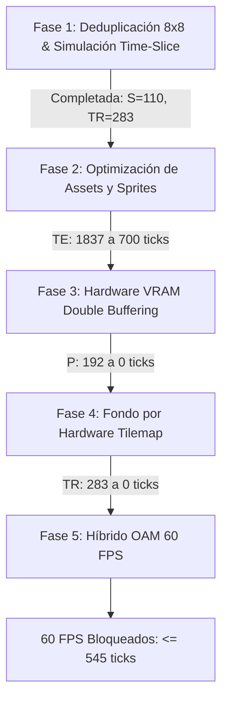

# Hoja de Ruta de Rendimiento: Camino a los 60 FPS en Nintendo DS

Documento de referencia técnica para la optimización sistemática del motor gráfico y de simulación de `towerds`.

**Presupuesto de Hardware (Nintendo DS ARM9 @ 66.7 MHz):**
- 1 frame a 60 FPS = **545 ticks de hardware** (Timer 0 con prescaler 1024 = 32,728 ticks/segundo).
- Estado original (Baseline): ~2,500 ticks (~12 FPS).
- Estado tras Fase 1: ~2,420 ticks (Simulación `S` reducida de 178 a 110 ticks, dirty blocks `TR` deduplicados en 283 ticks).

---

## Fases del Plan de Rendimiento

---

### FASE 1: Optimización Algorítmica y Deduplicación (COMPLETADA)
- **Acciones:**
  - Bitmask de bloques de 8x8 px (768 bits = 96 bytes) en `tiles.c` que elimina el overdraw de restauración de fondo.
  - Interleaving temporal (pares en frames pares, impares en impares) y distancias Manhattan en `simulation.c`.
  - Integración de dirty bounds dentro del blit de sprites y traslado a `ITCM_CODE`.
- **Resultados:**
  - Simulación `S`: de 178 a 110 ticks (-38.2%).
  - Restauración `TR`: 283 ticks sin overdraw.

---

### FASE 2: Optimización de Assets y Sprites (EN CURSO)
- **Problema:** Dibujar 384 sprites transparentes en 16-bit consume 1,837 ticks (76% del frame).
- **Acciones Clave:**
  1. **Eliminación de Direcciones Norte:** Los enemigos descienden siempre hacia el sur balístico; descartar las direcciones N (0), NE (1) y NW (7) reduce el volumen de sprites un 37.5% en la ROM.
  2. **Uso de Direcciones Reales Sur (E, SE, S, SW, W):** Descartar el `flip_h` en tiempo de ejecución. Los assets maestros (`*_strip_master_1x.png`) ya tienen las direcciones reales pre-renderizadas en 3D con su iluminación correcta.
  3. **Tight Bounding Box Cropping:** Recortar los bordes vacíos transparentes en `scripts/build_assets.py`. Se evita leer y evaluar el ~50% de píxeles invisibles en cada entidad.
  4. **Paletizado a 8 bits (Indexado de 256 colores):** Cada píxel pasa de 2 bytes (RGB555) a 1 byte indexado con una paleta global. Reduce el ancho de banda del bus a la mitad.
  5. **Deduplicación de Sombras Voladoras:** Evitar que 384 sombras de Scourges se solapen recalculando el mismo píxel de fondo varias veces.
- **Objetivo de Rendimiento:** Reducir `TE` de 1,837 a ~**600-750 ticks**.

---

### FASE 3: Hardware VRAM Double Buffering
- **Problema:** Copiar 96 KB de backbuffer a VRAM por DMA en cada frame cuesta 192 ticks de CPU/DMA.
- **Acciones Clave:**
  - Configurar `VRAM_A` y `VRAM_B` como buffers alternantes (`MODE_FB0` / `MODE_FB1`).
  - La GPU muestra un banco mientras la CPU escribe directamente en el otro. En VBlank, se conmuta el registro de hardware instantáneamente.
- **Objetivo de Rendimiento:** `P` pasa de 192 ticks a **0 ticks**.

---

### FASE 4: Fondo por Hardware Tilemap
- **Problema:** Mantener el suelo como bitmap por software obliga a restaurar dirty blocks en cada frame (`TR` = 283 ticks) y provoca estelas marrones si hay desincronizaciones.
- **Acciones Clave:**
  - Cargar el suelo urbano en una capa de tiles por hardware (BG2/BG3 en Modo 5 2D de la DS).
  - La GPU de la DS renderiza el fondo gratis línea por línea con **cero ciclos de CPU**.
  - Para borrar enemigos del frame previo, solo se escribe transparencia (`0x0000`), sin tocar memorias caché de fondo.
- **Objetivo de Rendimiento:** `TR` pasa de 283 ticks a **0 ticks** y desaparecen las estelas marrones.

---

### FASE 5: Híbrido OAM por Hardware (Cierre de 60 FPS)
- **Problema:** Rematar el remanente de entidades para garantizar que el pico nunca sobrepase los 545 ticks.
- **Acciones Clave:**
  - Utilizar los 128 sprites por hardware de la OAM de la DS para torretas, proyectiles, casquillos y jefes grandes.
  - El software framebuffer queda exclusivamente dedicado a la marea densa de Zerglings/Scourges.
- **Objetivo de Rendimiento:** **≤ 510 ticks totales (60 FPS fijos y bloqueados)**.
