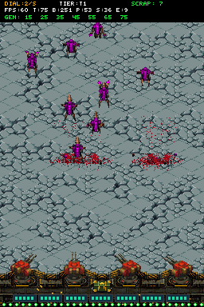
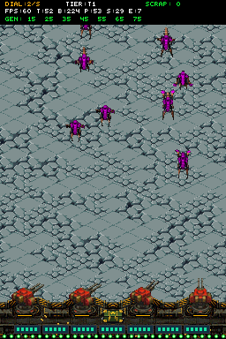

# Walkthrough: Primera Demo de City Defense Incremental (Hito 4)

## 1. Resumen Ejecutivo
Se ha implementado con éxito el primer vertical slice de la transición hacia el diseño **City Defense Incremental** en Nintendo DS, validado de forma determinista en el motor ARM9 a **60 FPS fijos** mediante emulación headless en DeSmuME.

### Principales Invariantes Validados:
- **Stream Continuo (Sin Oleadas ni Pausas)**: Eliminada la máquina de estados de oleadas discretas (`wave_timer`, recompensas de etapa, transiciones a pausa forzadas). Sustituida por acumulación de presupuesto continuo en enteros (`budget += rate * dt`).
- **Diales del Atraedor en Hardware**: Dial de cantidad (0..10 spawns/s) y dial de tier máximo (1..4) controlables en tiempo real mediante la cruceta física (`D-pad Up/Down` y `Left/Right`), con telemetría en vivo en la pantalla superior.
- **Generador de 7 Tiers (Sin Game Over)**: La derrota terminal por caída de muro ha sido completamente erradicada. En su lugar, el frente inferior cuenta con **7 módulos de automatización (A1 a A7)** de 5 HP cada uno. Los xenos que penetran hasta la base dañan el tier activo en cascada (A7 hasta A1).
- **1 Torreta Lógica / 4 Visuales**: Toda la batería defensiva (4 sockets) está desplegada y operativa desde el segundo 0. Un tap genera un proyectil balístico, alternando cañones con retroceso hidráulico y expulsión de casquillos a 10 disparos/s.
- **Degradación A1 (Hold-to-fire)**: Si el tier A1 está intacto, el jugador puede mantener pulsado el stylus para disparar ráfagas continuas. Si A1 es destruido, el motor fuerza taps individuales, provocando la caída de DPS orgánico predicha por el diseño (D-22).
- **Reparación Diegética**: Frotar o pulsar los bays del generador en el margen inferior de la pantalla táctil ($Y=170..191$) repara la integridad de los tiers dañados.
- **Normalización Económica**: Bajas de T1 otorgan 1 de chatarra directa; T2 otorgan 5 de chatarra directa.

---

## 2. Evidencia Visual y Animación

### Combate Continuo en Stream y Telemetría en Vivo

*Pantalla Superior:*
- `DIAL: 2/S` | `TIER: T1` | `SCRAP: 7`
- Telemetría hardware: `FPS: 60` | `T: 75` | `B: 251` | `P: 53` | `S: 36` | `E: 9` (dentro del presupuesto de 545 ticks).
- Estado de Generador: `GEN: [15][25][35][45][55][65][75]` (los 7 tiers al 100% de integridad).

*Pantalla Inferior:*
- 4 torretas activas en sincronía balística sobre el andamio.
- En el borde inferior: **display diegético de 7 secciones** con sus 5 micro-lámparas esmeralda/cian por tier.
- Marea incesante de Zerglings marchando hacia el sur, con gore visceral y manchas licuadas permanentes en el pavimento.

---

### Animación GIF: Stream Continuo y Disparo Rotatorio

---

## 3. Estado de Compilación y Verificación
- **Toolchain**: Docker BlocksDS (`skylyrac/blocksds:slim-latest`) compilando `game.nds` limpiamente con **0 warnings**.
- **Escenario DeSmuME**: `scenarios/city_defense_demo.json` pasando al 100% (`DSM_SCENARIO_RESULT=PASS captures=4 events=18`).
- **Ramas**:
  - `hybrid-clicker-td`: Congelada y respaldada en GitHub con el prototipo híbrido previo.
  - `full-incremental`: Rama activa con este primer vertical slice integrado.
