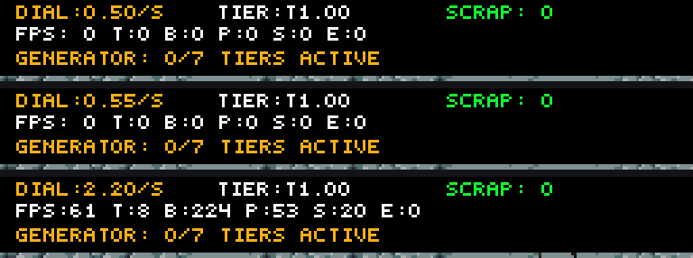
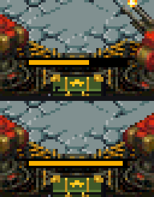

# Walkthrough: Dial de 0.05 con Autorepeat y Compuerta del Hold-to-Fire

Sesión: `dial-hold-fix` · Rama de trabajo: `full-incremental` · Baseline: `full-incremental` @ `e938e38`.

## 1. Resumen Ejecutivo

Dos bugs corregidos en el motor ARM9, con evidencia A/B determinista en DeSmuME:

1. **Dial del Atraedor con paso fino de 0.05 y autorepeat acelerado.** Antes el dial (D-pad) avanzaba en saltos de $0.25$/s y $0.1$ de tier y **no repetía al mantener** (usaba solo el flanco de la pulsación). Ahora avanza en pasos exactos de **$0.05$** y, al mantener la cruceta, acelera con una rampa de repetición.
2. **El Hold-to-Fire (A1) ya no se desbloquea solo.** La compuerta del disparo continuo usaba `g_generator.tiers[0].active`; por eso, erigir o **reparar** el Tier 1 del Generador sin comprar A1 habilitaba la ráfaga (el HUD seguía marcando `GENERATOR: 0/7`). Ahora exige la mejora A1 **y** el Tier 1 vivo.

## 2. Antes vs Ahora

| Aspecto | Antes (baseline `e938e38`) | Ahora |
| :--- | :--- | :--- |
| Paso del dial (tasa / tier) | $0.25$/s y $0.1$ por pulsación | **$0.05$** exacto en ambos ejes |
| Mantener pulsado la cruceta | No repetía (solo 1 escalón por pulsación) | **Autorepeat con rampa** (10 f → cada 4 f → cada 2 f → cada frame) |
| HUD del dial | `DIAL:X.Y/s`, `TIER:TX.Y` (1 decimal) | **`DIAL:X.XX/s`, `TIER:TX.XX`** (2 decimales) |
| Acumulador de spawn | `spawn_budget_q8 += dial_rate_q8 / 60` (truncaba: tasas < ~0.23$/s **no generaban**) | `spawn_budget_q8 += dial_rate_q8` con umbral `60*256` (sin truncado) |
| Compuerta del Hold | `g_generator.tiers[0].active` (se activaba al reparar/calibrar el Tier 1) | `upgrades.continuous_fire && g_generator.tiers[0].active` |

## 3. Fix 1 — Dial de 0.05 con autorepeat

**Qué hace ahora:** cada pulsación de UP/DOWN (tasa) o LEFT/RIGHT (tier) mueve **un tick de 0.05**. Mantener la dirección repite: primer eco a los ~12 f, luego cada 4 f, después cada 2 f y finalmente cada frame. El HUD superior muestra dos decimales para que el escalón sea visible.

**Cómo está programado:**
- `include/game.h`: nuevos campos fuente de verdad `dial_rate_ticks` (0..200 ↔ 0.00..10.00/s) y `dial_tier_ticks` (20..80 ↔ T1.00..T4.00), más `dial_rate_hold_timer` / `dial_tier_hold_timer`.
- `source/simulation.c`: `dial_rate_sync()` / `dial_tier_sync()` derivan las vistas Q8 (`dial_rate_q8`, `dial_tier_q8`, `dial_max_tier`, `spawn_rate_q8`). El bloque D-pad de `game_handle_input_wave()` implementa paso + rampa de autorepeat.
- `source/renderer.c`: `renderer_draw_ui_wave()` y la página 0 de calibración imprimen `X.XX` a partir de los ticks.

**Por qué ticks y no Q8:** Q8 ($1/256$) **no** representa $0.05$ ($0.05 \times 256 = 12.8$). Usar ticks de $1/20$ hace que $0.05$ sea exacto y que el display sea limpio; las vistas Q8 se derivan para el acumulador y la mezcla de biocastas.

**Evidencia (HUD superior, ×3):** boot `DIAL:0.50/s` → un tap `DIAL:0.55/s` → mantener UP 60 f `DIAL:2.20/s`; un par de taps de tier `TIER:T1.00 → T1.10`.



## 4. Fix 2 — Compuerta del Hold-to-Fire

**Qué pasaba:** `game_handle_input_wave()` calculaba `a1_active = g_generator.tiers[0].active`. El Tier 1 también se activa por la **reparación diegética** (tocar la franja inferior del Generador, `Y=170..191`) y por calibración, sin comprar A1 y sin subir `built_tiers` (de ahí el `GENERATOR: 0/7` engañoso). Resultado: mantener el stylus disparaba en ráfaga a máxima cadencia sin la mejora.

**Cómo está ahora:**
```c
int a1_active = g_game.upgrades.continuous_fire && g_generator.tiers[0].active;
int can_trigger = touch_press || a1_active;
```
Esto respeta `DESIGN.md [OQ-02]` (A1 es la única puerta del Hold) y la degradación de automatizaciones de `TECHNICAL.md` §5 (si el Tier 1 cae, el Hold vuelve a tap manual).

**Evidencia A/B (escenario `scenarios/hold_gate_repair_repro.json`, mismo gesto: reparar bahía 0 + hold 180 f):**
El cargador compartido es 40 balas a Lv0 y la barra mide 40 px, así que **cada píxel que baja = un disparo**.

| ROM | Munición tras el hold | Disparos |
| :--- | :--- | :--- |
| Baseline `e938e38` (crc `2F8816A5`) | 40 → **25** px | **15** (ráfaga a máxima cadencia) |
| Nueva (crc `3F2535A3`) | 40 → **39** px | **1** (solo el tap) |

Recortes ampliados ×4 de la barra de munición sobre el depósito (arriba: baseline 15 disparos; abajo: nueva 1 disparo):



## 5. Escenarios y Regresión

- Nuevos: `scenarios/dial_step_accel.json`, `scenarios/hold_gate_shop.json`, `scenarios/hold_gate_repair_repro.json`.
- Regresión verde: `scenarios/phase1_vertical_slice.json` → `DSM_SCENARIO_RESULT=PASS captures=7 events=94` con la ROM nueva.
- A/B construido desde el commit anterior real: baseline = `git archive full-incremental` (HEAD sin mis cambios), ROM compilada en `artifacts/baseline/`.

## 6. Estado Honesto y Límites

- **Verificado en emulador (headless DeSmuME):** el paso de $0.05$, el autorepeat, el display a 2 decimales y la compuerta del Hold (métricas de píxeles del cargador + A/B).
- **No verificado en hardware:** el tacto resistivo real y los botones físicos de la DS. Los escenarios inyectan input por el *frontend* del emulador; la validación física (tacto y audio) queda pendiente en consola.
- **Preexistente (ajeno a esta sesión):** `scenarios/test_shop_continuous_fire.json` falla con `screen_unchanged` porque asume un arranque en pausa; la ROM arranca en modo stream. No lo he tocado.
- **Observación (no corregida para no ampliar alcance):** la reparación diegética sigue activando un Tier 1 "fantasma" (`tiers[0].active=1` con `built_tiers=0`) que ya no desbloquea el Hold, pero cuyas bombillas no se renderizan como construidas.

## 7. Ficheros Modificados

- `include/game.h` — campos del dial en ticks + temporizadores de autorepeat.
- `source/simulation.c` — `dial_rate_sync`/`dial_tier_sync`, init, acumulador de spawn, control D-pad con autorepeat, compuerta del Hold, calibración en ticks.
- `source/renderer.c` — display a 2 decimales (HUD y calibración).
- `DESIGN.md`, `TECHNICAL.md`, `STATUS.md` — coherencia documental.
