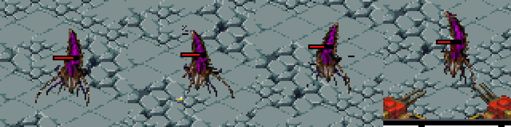
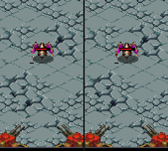
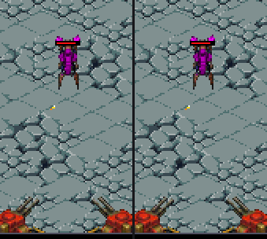
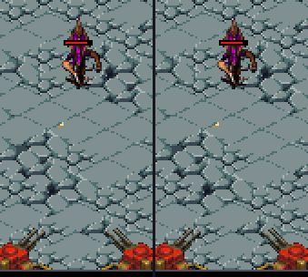
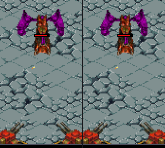
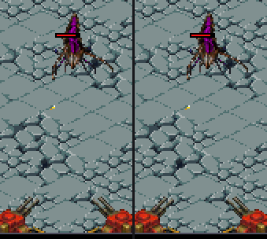
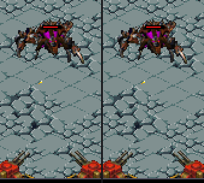
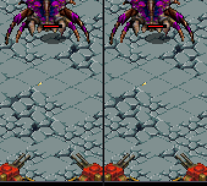
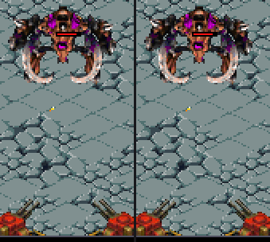
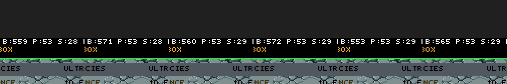

# Walkthrough: Desmembramiento en vivo — arrancar trozos al impactar

**Sesión:** `feat/live-dismemberment` · **Base:** `full-incremental` · **ROM:** SHA256 `5BF706B9…108E3`

Al enemigo se le van **arrancando trozos mientras sigue vivo**: cada impacto le muerde una celda del
sprite **en el borde** y lanza ese mismo trozo como escombro sólido. La mordida es **irregular**, deja al
descubierto la **carne oscura del caparazón arrancado**, lo que mide **2 px o menos se arranca entero**,
y nada queda flotando. Cuánto se destroza va **atado a la vida perdida**: lo que está hecho jirones lo
está porque está casi muerto. Al morir, el licuado desprende **sólo lo que queda**.

Es **puramente cosmético**: la máscara de heridas se deriva del daño que el enemigo ya recibe y no toca
HP, daño, velocidad ni colisión (la colisión por variante es un círculo de `s_hit_r[]`, no
*pixel-perfect*).

Toda la evidencia se ha generado ejecutando la ROM real en **DeSmuME headless** con
`scripts/run-scenario.ps1`; no hay contenido sintético. Todas las capturas usan **un solo individuo**.

La función se puede compilar en **dos modos** —sin amputación (**por defecto**) y con amputación— y la
galería de §3 los muestra **lado a lado** con los mismos fotogramas.

---

## 1. Antes vs ahora

| | **Antes** | **Ahora** |
| :--- | :--- | :--- |
| Impacto no letal | **Nada** (sólo se restaba HP) | Arranca un trozo del sprite y lo lanza como escombro |
| Dónde se arranca | — | **En el borde de la silueta**, nunca en el interior: el xeno se *pela* de fuera a dentro |
| Forma de la mordida | — | **Irregular y en grumos** (bloques de 2×2 según un patrón): sin motas sueltas ni cuadrados |
| El trozo que vuela | — | Mismo patrón que la mordida: es **exactamente** el trozo que falta |
| Lo que se ve al arrancar | — | **Carne roja oscura** de caparazón arrancado |
| Apéndices finos | — | Lo que mida **2 px o menos** se **arranca entero** |
| Fragmentos flotantes | — | **Ninguno**: lo que un corte deja desconectado se desprende entero |
| Cuánto se destroza | — | **Proporcional a la vida perdida**: un xeno casi intacto no se destroza por muchos tiros que reciba |
| Golpe letal | — | **No genera herida**: de ese cuerpo ya se encarga el licuado |
| Al morir | El licuado dibujaba el cuerpo **entero** | El licuado desprende **sólo los restos** |
| Mecánica | — | Ninguna: **cosmético** |

---

## 2. Las reglas del destrozo

**a) Sólo se arranca del borde.** Al elegir la celda se exige que sea **celda de silueta** (tiene píxeles
de cuerpo y algún vecino vacío, ya mordido, o fuera de la rejilla). Con eso el xeno se erosiona **de
fuera hacia dentro** y nunca aparecen agujeros internos, que leían como bug. Si la silueta no tuviera
borde disponible, se concede una celda interior como último recurso.

**b) La mordida es irregular y en grumos.** Dentro de una celda mordida sólo desaparecen los píxeles que
pasa un patrón determinista calculado sobre **bloques de 2×2** (`WOUND_DENSITY`), así que el contorno
queda desgarrado y sin motas aisladas. **El mismo patrón** decide los píxeles del `GoreChunk` que sale
volando: el trozo que gira por el aire es exactamente el que falta en el cuerpo.

**c) Lo arrancado muestra carne, no un agujero.** La zona mordida se repinta con la carne roja oscura
(`COLOR_XENOS_GORE_DARK` / `TOP_COLOR_XENOS_GORE_DARK`), que lee como *"le han arrancado el caparazón"*.
Existe la alternativa de dejar un agujero translúcido por el que se ve el empedrado, pero sobre un suelo
texturado confunde bastante más; queda como interruptor (`WOUND_STYLE 0`), no como valor por defecto.

**d) Sólo se amputa lo genuinamente fino.** La decisión es **por píxel**, no por celda: un píxel cuyo
entorno 3×3 (`WOUND_THIN_R 1`) **no** está completamente lleno pertenece a algo de **2 px o menos** y se
**elimina**; cualquier píxel con más masa alrededor se repinta. Un umbral más ancho se comía regiones que
ya no son apéndices y dejaba huecos en el cuerpo.

**e) Nada queda flotando.** Un corte puede desconectar un trozo (una pata unida por un apéndice fino).
Tras cada mordida se recalcula, **sobre la rejilla de celdas**, qué partes han quedado desconectadas: la
mayor se conserva y el resto **se arranca entero**. Una amputación se lee como tal —el miembro cae— en
vez de dejar un segmento flotando en el aire.

**f) El destrozo va atado a la salud.** El presupuesto de heridas no es fijo: sólo está disponible la
**fracción de vida ya perdida**, cuantizada en `WOUND_HP_TICKS` pasos. Un enemigo al 90% de vida puede
perder como mucho una décima parte del cupo de trozos por muchos impactos que reciba; el cupo completo
(`WOUND_MAX_PCT`) sólo se alcanza al borde de la muerte. La herida se resuelve **después** de aplicar el
daño del impacto, y un **golpe letal no genera herida**. Así el aspecto nunca contradice al estado, y no
pasa lo de llegar a la muralla hecho jirones mientras todavía pega fuerte.

Progresión con el ajuste por defecto (Defiler, un solo individuo):

### Los dos modos

| | **Sin amputación** (`WOUND_AMPUTATE 0`, **por defecto**) | **Con amputación** (`WOUND_AMPUTATE 1`) |
| :--- | :--- | :--- |
| Lo que mide ≤ 2 px (d) | Se repinta como el resto | Se **arranca entero** |
| Trozo que un corte desconecta (e) | No se desprende: la silueta no cambia nunca | **Se desprende** (amputación real) |
| Silueta | **Intacta** de principio a fin | Se erosiona conforme el xeno pierde vida |
| Escombro lanzado | Sólo recortado por el patrón | Recortado por el patrón, y los apéndices enteros |
| Reglas a, b, c y f | Iguales | Iguales |

En modo sin amputación la lectura es *"se le va enrojeciendo el caparazón"*; en modo con amputación,
además, *"va perdiendo miembros"*. La diferencia se ve en la galería de §3: **derecha sin amputación (el
modo por defecto), izquierda con**. El modo sin amputación es el valor por defecto; el otro se conserva
en el código como alternativa seleccionable.

---

## 3. Las 8 especies

Un GIF por variante, capturado en el sandbox con **un solo individuo** y la batería a **daño 1** (el
default; el "5 DMG" que se ve en el HUD del sandbox es del sistema de torretas legado y no afecta al
muro). Recorte del campo de batalla inferior, ×2.

**Cada GIF es una comparación lado a lado**: **izquierda, con amputación**; **derecha, sin amputación**
(el modo por defecto). Mismos fotogramas y mismo recorte, así que la única diferencia es la amputación.

> **Nota sobre el balance de los GIF.** Las capturas se hicieron con una **tabla de HP provisional**
> (plana: 12 para las ocho especies) para que **todas aguanten varios disparos** y el desmembramiento se
> vea. Con la tabla real, el **Scourge (1 HP)** revienta al primer impacto sin mostrar nada y el
> **Ultralisk (135 HP)** apenas se entera, así que la función no se leería. **El juego conserva su tabla
> maestra tal cual** (`g_balance.enemy[]` sin tocar); esto es sólo el ajuste de captura. Para reproducir
> los GIF hay que fijar `hp = 12` en las ocho filas antes de grabar y revertirlo después.
>
> El **Scourge** es además el caso extremo por velocidad (120 px/s): cruza la zona de fuego en ~1 s, así
> que sólo recibe unos 5 impactos por pasada. Su GIF muestra el desmembramiento pero no la muerte.

| ID | Especie | Frame | Frames anim | GIF |
| :---: | :--- | :---: | :---: | :--- |
| 0 | **Scourge** (volador) | 31×27 | 5 |  |
| 1 | **Zergling** | 40×39 | 7 |  |
| 2 | **Hydralisk** | 42×55 | 7 |  |
| 3 | **Mutalisk** (volador) | 64×72 | 5 |  |
| 4 | **Defiler** | 69×59 | 8 |  |
| 5 | **Lurker** | 69×64 | 7 |  |
| 6 | **Guardian** (volador) | 78×70 | 7 |  |
| 7 | **Ultralisk** | 98×105 | 9 |  |

> El **Scourge tiene 1 de vida**: muere al primer impacto, así que nunca muestra heridas. Es coherente
> con la regla (f) —no hay vida perdida que pagar— y su GIF lo deja ver.

---

## 4. Cómo está programado

- **Representación:** máscara de bits de dos planos en `Enemy.wound_bits[WOUND_MASK_WORDS]` +
  `wound_count` (`include/game.h`): celdas mordidas y celdas arrancadas enteras.
- **Rejilla normalizada, no bloque en píxeles:** la celda se calcula sobre el *bounding box* del frame
  (`sx * WOUND_GRID / w`), de modo que la mordida **no salta** al ciclar la animación ni al cambiar de
  dirección.
- **Selección de celda:** `wound_find_cell()` (`source/simulation.c`) busca en anillos la celda mordible
  más cercana al impacto con `require_edge`; `enemy_wound_from_impact()` intenta primero borde y sólo
  después cede a una interior.
- **Presupuesto por salud:** `enemy_wound_from_impact()` calcula cuántos trozos puede haber perdido el
  cuerpo a partir de `hp` frente a `max_hp`, cuantizado en `WOUND_HP_TICKS` pasos. Se llama **después**
  de descontar el daño del impacto y sólo si el golpe no es letal.
- **Patrón compartido:** `wound_pixel_gone(cell_bit, sx, sy)` (`include/game.h`) decide, por celda y
  píxel, si ése se ha ido. Lo usan el dibujo **y** el escombro, así que coinciden.
- **Grosor por píxel:** `wound_pixel_is_thin(src, w, h, sx, sy)` dice si el píxel mide 2 px o menos de
  ancho; ésos se eliminan. Se evalúa sólo dentro de las celdas mordidas.
- **Sin islas:** `wound_detach_islands()` rehace el grafo de celdas tras cada mordida (dos recorridos en
  anchura sobre ~36 celdas, una vez por impacto) y marca como "arrancada entera" toda parte desconectada.
- **Escombro:** `spawn_wound_debris()` extrae el parche con los **índices de paleta reales**, aplica el
  mismo criterio de forma y lo lanza como `GoreChunk`.
- **Dibujo:** la máscara se aplica en las **tres** rutas de `source/enemy_data.c`
  (`enemy_draw_sprite_to_buffer`, `enemy_draw_sprite_to_buffer8` y `enemy_draw_melting_sprite`), así que
  la mordida es idéntica en las dos pantallas (16-bit y 8-bit indexado) y la muerte no vuelve a dibujar
  lo ya arrancado.
- **Fast path intacto:** los enemigos **sin** heridas conservan el camino de quads de 32 bits; sólo los
  heridos pagan un camino por píxel.

### Interruptores (`include/game.h`)

| Define | Valor | Qué controla |
| :--- | :---: | :--- |
| `WOUND_GRID` | 6 | Rejilla de celdas por eje (6×6). |
| `WOUND_MAX_PCT` | 60 | Cupo de trozos, en % de celdas, **al borde de la muerte**. |
| `WOUND_DENSITY` | 176 | Cuánto se lleva cada mordida dentro de la celda (0..255). |
| `WOUND_THIN_R` | 1 | Radio del test de grosor: 1 ⇒ sólo se amputa lo de ≤ 2 px. |
| `WOUND_HP_TICKS` | 8 | Pasos de salud en que se abre el cupo. |
| `WOUND_AMPUTATE` | 0 | **0** = sólo enrojecer (**por defecto**); **1** = amputación real. |
| `WOUND_STYLE` | 1 | **1** = carne roja de caparazón arrancado; **0** = agujero translúcido. |
| `LIVE_DISMEMBERMENT_ENABLED` | 1 | **0** desactiva la función entera (sprites intactos). |

---

## 5. Coste y rendimiento

**Método.** Mismo escenario (`scenarios/perf_wound.json`: sandbox, **6 Ultralisks** —el sprite más
grande, 98×105— spawneados al principio de la zona de fuego, 600 fotogramas) ejecutado con la función
**ON** y **OFF**, leyendo los ticks `B` de la pantalla inferior del HUD. Tres fotogramas por corrida,
todos con `ALIVE: 6`.

| Fotograma | OFF | ON | Δ |
| :--- | :---: | :---: | :---: |
| 120 | 559 | 571 | **+12** |
| 240 | 560 | 572 | **+12** |
| 400 | 553 | 565 | **+12** |

- **+12 ticks constantes** (≈ **+2.2%**) con ~1 enemigo herido en pantalla. La repetición exacta en tres
  fotogramas indica que no es ruido.
- **El baseline ya está por encima del presupuesto** en esta carga artificial (`B:553 > 545` ⇒ FPS 30):
  seis Ultralisks a la vez saturan la pantalla inferior por sí solos. El desmembramiento **no** es lo que
  saca el frame de presupuesto; añade un 2% encima.

**Lectura estructural (a confirmar).** Forzar el cupo de heridas no cambió los ticks, lo que apunta a que
el coste **no depende de cuántas celdas están mordidas**, sino de **cuántos sprites** bajan al camino por
píxel: un enemigo con una sola herida abandona el fast path de quads para **toda** su superficie. Con esa
lectura, ~12 ticks por sprite grande herido es la cifra que escala, y conviene tratarla como orden de
magnitud y no como medida cerrada: la propia cuantización por salud impide forzar limpiamente el caso
"muchas celdas heridas".

**Mitigación recomendada si el enjambre se satura:** enmascarar por **quad** de 4×4 en vez de por píxel
(saltar sólo los quads de las celdas mordidas y conservar el fast path para el resto del sprite). Eso
haría el coste proporcional al **área herida** y no al **área del sprite**, que es lo que se paga hoy.

Otros límites:

- **Un enemigo sin heridas cuesta exactamente lo mismo que antes** de esta función (`wound_any()` corta
  antes de entrar al camino por píxel).
- **Pools compartidos:** `MAX_GORE_CHUNKS` (48) y `MAX_DEATH_PARTICLES` (256) se comparten con las
  muertes; `spawn_wound_debris()` **cede** si el pool está lleno (la mordida se ve igual, sólo se omite
  el escombro).
- Por la regla (f), los enemigos recién spawneados y los de 1 de vida **no pagan ningún coste**.

---

## 6. Hallazgos colaterales

- **El sandbox headless SÍ es accesible.** `KNOWN_ISSUES.md` dice que "no entra de forma fiable", pero la
  causa real es otra: los escenarios existentes capturaban **antes del primer render completo del HUD**,
  así que comparaban fotogramas idénticos y daban `screen_unchanged`. Con **90 frames de arranque** antes
  de la primera captura, `L + SELECT` entra, el **D-Pad** cambia de especie y el **tap** spawnea en la
  pantalla inferior. Es un defecto del contrato de esos escenarios, no del juego.
- **No usar el overdrive `L+R` para esto:** fuerza `g_wall.damage = 6`, y con eso un Zergling muere al
  primer tiro sin mostrar heridas.
- **`PIL` sólo está en el `python` de Windows**, no en el `python3` de WSL (sin pip). Los GIF se componen
  con el Python de Windows.

---

## 7. Pendiente

- Enmascarado por **quad** en vez de por píxel, si el enjambre llega a saturar (ver §5).
- Barrido fino de `WOUND_GRID` / `WOUND_MAX_PCT` / `WOUND_DENSITY` / `WOUND_THIN_R` / `WOUND_HP_TICKS`
  sobre Zergling, Defiler y Ultralisk.
- Entrada `[OQ-12]` en `DESIGN.md` y nota en `TECHNICAL.md` (regla 7 de `AGENTS.md`), más la corrección
  de la entrada obsoleta de `KNOWN_ISSUES.md`.
