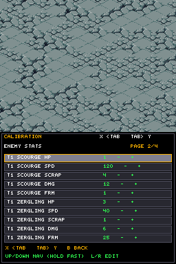
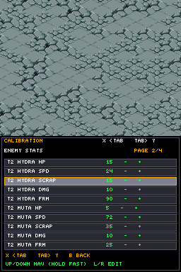
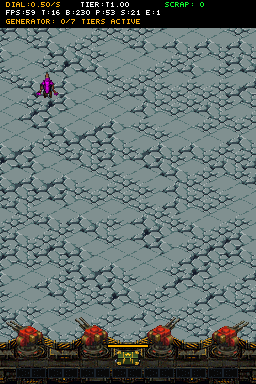

# Sesión: Tabla maestra única de enemigos (tier → stats) + calibración

**Rama:** `full-incremental` · **Baseline (antes):** `be5790d`

## Qué se pidió

1. **Unificar** las estadísticas de enemigos en **una sola tabla maestra** que se lea desde *todos*
   los sistemas (spawn, muerte, mordisco, sandbox) y que sea **la que se edita en el menú de calibración**.
2. Organizar los enemigos en **tiers** (dos especies por tier).
3. **Eliminar las copias muertas** de balance en vez de dejarlas desactivadas.

## Antes vs ahora

**Antes** había **tres fuentes de verdad desincronizadas** y el spawn no leía ninguna:

- `EnemyTypeDef.default_hp` / `.scrap_value` (`source/enemy_data.c`) — **datos muertos**, no se leían en ningún sitio.
- Los arrays `enemy_hp[]`, `enemy_speed[]`, `enemy_scrap[]`, `enemy_bite_*[]` de `GameBalanceConfig`
  — solo los leía la *UI* de calibración, **no** el gameplay.
- `config/balance/*.csv` + `tools/compile_balance.py` — pipeline legacy, **fuera del build** (y con magic distinto al que carga el juego).

El **spawn continuo era puro literal**: elegía variante por un `if`-chain fijo y HP `3/15/45/120`
escritas a mano (`source/simulation.c:1168-1187`).

**Ahora** hay **una tabla maestra** — `GameBalanceConfig.enemy[]`, un `EnemyStatDef` por variante —
y **todo** cuelga de ella.

### La tabla (semilla actual)

`{ tier, hp, speed(px/s), scrap, bite_damage, bite_interval(frames) }`

| v | Especie | Tier | HP | Speed | Scrap | Bite (dmg/int) |
| :-: | :-- | :-: | --: | --: | --: | --: |
| 0 | Scourge | **T1** | 1 | 120 | 4 | 12 / 1 |
| 1 | Zergling | **T1** | 3 | 40 | 1 | 6 / 25 |
| 2 | Hydralisk | **T2** | 15 | 24 | 15 | 10 / 90 |
| 3 | Mutalisk | **T2** | 5 | 72 | 35 | 10 / 25 |
| 4 | Defiler | **T3** | 45 | 22 | 70 | 20 / 30 |
| 5 | Lurker | **T3** | 45 | 22 | 70 | 20 / 30 |
| 6 | Guardian | **T4** | 135 | 18 | 250 | 30 / 45 |
| 7 | Ultralisk | **T4** | 135 | 18 | 250 | 30 / 45 |

- **El tier agrupa dos especies** y marca su nivel de amenaza: **T1** Scourge+Zergling, **T2** Hydralisk+Mutalisk,
  **T3** Defiler+Lurker, **T4** Guardian+Ultralisk. El dial del Atraedor selecciona el tier; dentro del tier
  el enjambre alterna al azar entre sus dos especies.
- **Regla del par:** ambos miembros comparten **HP base** (T1=3, T2=15, T3=45, T4=135); el **volador** es
  **más frágil (⅓ de HP)** y **más rápido (×3 de velocidad)** → amenaza por evasión, no por aguante
  (Scourge 1 HP @120 vs Zergling 3 @40; Mutalisk 5 @72 vs Hydralisk 15 @24).
- **Velocidad y daño de mordisco no son de tier**: los fija la tabla por variante (no están en `DESIGN.md`,
  son **provisionales**). El scrap de T3/T4 también es provisional.

## Cómo se implementa (qué se tocó)

- **`include/game.h`** — nuevo `EnemyStatDef` y el array `EnemyStatDef enemy[ENEMY_VARIANT_COUNT]` dentro de
  `GameBalanceConfig` (sustituye los 5 arrays paralelos). Magic del balance **`TOW6` → `TOW7`** (`0x544F5737`)
  porque cambia el layout del struct.
- **`source/simulation.c`**
  - `s_default_balance`: nueva semilla (tabla de arriba).
  - **Spawn continuo** (`game_update_simulation`, ~L1158): mantiene la interpolación fraccionaria del dial,
    pero elige el tier y sortea variante entre las especies de ese tier, leyendo `hp`/`speed` de la tabla.
  - **Muerte** (~L1721): `g_balance.enemy[v].scrap` (con multiplicador de Bio-Cosecha).
  - **Mordisco** (~L1308 y ~L1425): `g_balance.enemy[b_variant].bite_interval` / `.bite_damage`.
  - **Sandbox** (`game_sandbox_spawn_enemy`, ~L2422): lee `hp`/`speed` de la tabla según la especie elegida;
    se eliminaron los campos propios `sandbox.enemy_hp` / `sandbox.enemy_speed` y sus dos filas de menú.
- **`source/renderer.c`** — página **`ENEMY STATS`** de calibración: cada fila se rotula con su tier
  (`"T2 MUTA HP"`), construido en runtime desde `g_balance.enemy[e].tier`; lee los valores de la tabla.
  La UI del sandbox pasa a 3 filas (especie, cadencia, daño de bala).
- **`include/enemy_data.h` / `source/enemy_data.c` / `scripts/build_assets.py`** — fuera `default_hp` y
  `scrap_value` (16 líneas en el `.c` generado).
- **Borrados**: `config/balance/enemies.csv`, `waves.csv`, `upgrades.csv`, `tools/compile_balance.py`,
  `scripts/export_enemy_data.py`. `tools/serve_balance.py` actualizado (ya no remite a `compile_balance.py`).
- **Docs**: `DESIGN.md` §7 (columna **Tier** + HP reales + "Regla de Tiers") y §8 (páginas de calibración);
  `TECHNICAL.md` (invariante de la tabla maestra + fila `EnemyStatDef`); `docs/BALANCE_DATA.md` (retirada del
  pipeline CSV).

## Cómo se edita en la DS

`SELECT` → calibración → **`ENEMY STATS`** (página 2/4). 8 especies × 5 campos
(**HP / SPD / SCRAP / DMG / FRM**), cada fila rotulada con su tier. Los cambios se aplican al vuelo y se
persisten en `fat:/towerds_balance.bin` (magic `TOW7`; un `.bin` con magic viejo se ignora y se usan los defaults).

## Evidencia (determinista, DeSmuME headless)

- **Build**: `DS_BUILD=PASS` (BlocksDS Docker).
- **Escenario**: `scenarios/master_table_tier_check.json` → `DSM_SCENARIO_RESULT=PASS captures=5 events=61`.
- **Capturas** (pantalla de la DS, 256×384):

**T1 — `ENEMY STATS` (página 2/4):** `T1 SCOURGE HP 1 · SPD 120 · SCRAP 4 · DMG 12 · FRM 1` y
`T1 ZERGLING HP 3 · SPD 40 · SCRAP 1 · DMG 6 · FRM 25`. Coincide con la semilla.

**T2 (tras desplazar la lista):** `T2 HYDRA HP 15 · SPD 24 · DMG 10 · FRM 90` y
`T2 MUTA HP 5 · SPD 72 · SCRAP 35 · DMG 10 · FRM 25`.

**Gameplay con el stream corriendo** — HUD `DIAL: 0.50/S  TIER: T1.00`, enemigos del tier 1 en pantalla.

## Límites honestos (lo que NO está cerrado)

- **Velocidad y daño de mordisco son provisionales** (no existen en `DESIGN.md`): hay que rebalancearlos.
- **T3/T4 tienen ambos miembros iguales** de momento; falta diferenciarlos (misma regla del par volador).
- **Scrap de T3/T4 provisional** (puede que el scrap pase a ser un valor por tier).
- **Validación en DS física pendiente**: la edición por cruceta y el guardado en microSD se validan aquí con
  evidencia no determinista de bytes; la sensación final (cruceta/botones) es de hardware.
