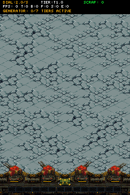
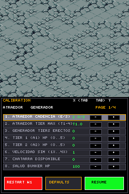
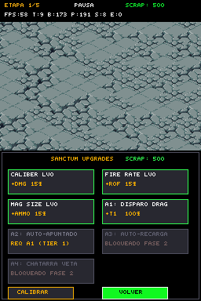
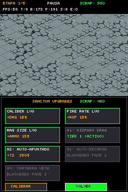
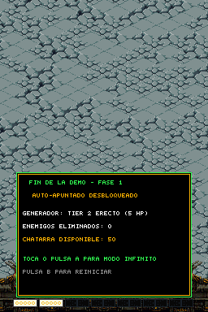
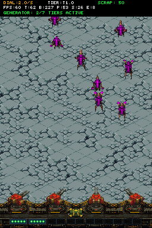
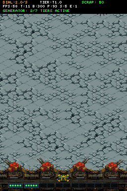

# Walkthrough: Fase 1 Vertical Slice — City Defense Incremental

## 1. Resumen Ejecutivo
Se ha consolidado el diseño canónico de **City Defense Incremental** en el motor ARM9 a **60 FPS fijos** mediante ejecución determinista en DeSmuME:
1. **Retirada de Bombillas Viejas del Muro:** Se elimina la hilera de 32 bombillas del zócalo inferior ($Y=188$), incoherente con el nuevo modelo sin Game Over de muro.
2. **Bombillas de Cátodo Diegéticas por Bahía:** Cada una de las 7 bahías del Generador incorpora 5 micro-bombillas de cátodo de fósforo verde (5 HP por módulo). Al recibir impacto, parpadean en blanco/oro y se apagan una a una. En los andamios no construidos, los zócalos se muestran como anclajes vacíos.
3. **Limpieza del HUD Superior:** Se retira la telemetría de depuración `GEN:[X0]...` sustituyéndola por el banner diegético `GENERATOR: X/7 TIERS ACTIVE`.
4. **Dial del Atraedor Continuo:**
   - **Tasa de Spawn Continua:** Acumulación en punto fijo Q8 (`spawn_budget_q8 += dial_rate_q8 / 60`), permitiendo ritmos continuos (ej: $2.0$/s, $2.25$/s, etc.).
   - **Distribución de Biocastas Continua:** Interpolación probabilística continua basada en el valor Q8 del dial de amenaza ($T \ge 1.0$). Si $T = 1.3$, genera 70% T1 (Zergling) y 30% T2 (Scourge/Hydra) sin saltos discretos artificiales.

---

## 2. Evidencias Visuales Deterministas (DeSmuME)

### 1. Andamio inicial (Tier 0 — Inactivo)
Estructura de acero con zócalos vacíos y zócalo inferior limpio sin bombillas redundantes.
- [Abrir 01_scaffold_boot.png](assets/01_scaffold_boot.png)

---

### 2. Menú de Calibración (Página 0: Atraedor & Generador)
Dial de cadencia continuo ($2.0$/s) y biocasta continua ($T1.0$), con ajuste decimal interactivo.
- [Abrir 02_calib_stream_page0.png](assets/02_calib_stream_page0.png)

---

### 3. Tienda de Mejoras inicial
7 cartas de mejoras: 3 balísticas en escala x2, automatizaciones A1 (Hold-to-shoot) y A2 (Auto-target).
- [Abrir 03_shop_unbought.png](assets/03_shop_unbought.png)

---

### 4. Bahía 1 Montada con Bombillas de Cátodo
Al comprar A1 (100 chatarra), la Bahía 1 se ilumina con sus 5 bombillas verdes de cátodo activas.
- [Abrir 04_shop_bought_a1.png](assets/04_shop_bought_a1.png)

---

### 5. Pantalla de Victoria de Fase 1
Al comprar A2 (350 chatarra), se levanta la Bahía 2 y se activa el fin de demo.
- [Abrir 05_victory_phase1_complete.png](assets/05_victory_phase1_complete.png)

---

### 6. Defensa Continua con Auto-Apuntado y HUD Limpio
HUD superior mostrando `DIAL: 2.0/s`, `TIER: T1.0` y `GENERATOR: 2/7 TIERS ACTIVE`, con la batería disparando ráfagas continuas contra el enjambre.
- [Abrir 07_stream_defense_with_a2.png](assets/07_stream_defense_with_a2.png)

---

### 7. Demostración en GIF (Combate, Recoil, Cátodos y Casquillos)
- [Abrir phase1_combat.gif](assets/phase1_combat.gif)

