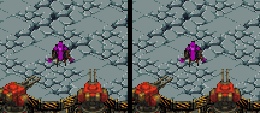
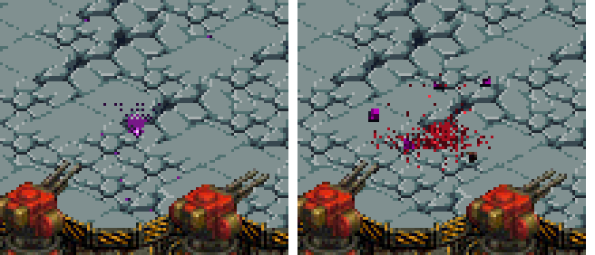
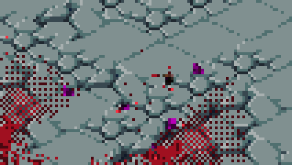
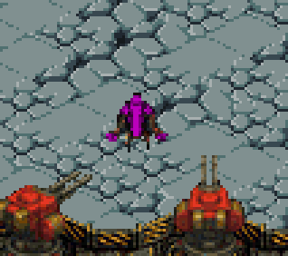
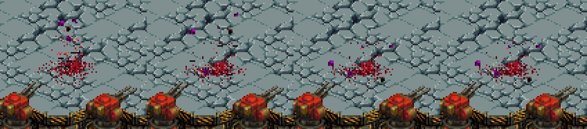
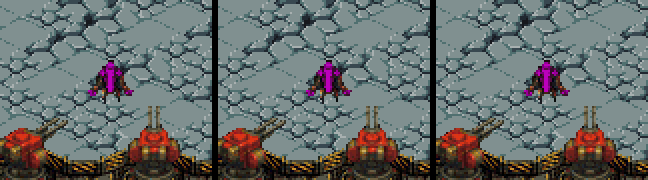
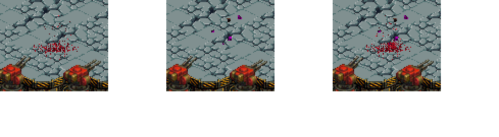

# Walkthrough: Muerte de los enemigos — gore, licuado y trozos

**Sesión:** `feat/splatter-impact-direction` · **Rama:** `main` · **ROM:** SHA256 `9AE11C25…9CA8`

Este documento compara **cómo era la muerte de un enemigo al empezar esta tarea** con **cómo es
ahora**, explica **cada efecto** (qué hace, cómo está programado y cuánto cuesta) y deja la evidencia
visual. No es un histórico de cambios: es el **estado final** y su justificación.

Toda la evidencia se ha generado ejecutando la ROM real en **DeSmuME headless** con
`scripts/run-scenario.ps1`; no hay contenido sintético. Los GIF/stills se montan con ffmpeg a partir
de esas capturas.

---

## 1. Antes vs ahora

| | **Antes** (HEAD al empezar la tarea) | **Ahora** |
| :--- | :--- | :--- |
| Al impactar | Salpicadura de sangre en **cada disparo**, siempre hacia arriba, ignorando el ángulo | Sin salpicadura por impacto |
| Al morir | El enemigo **desaparecía en 1 frame** y dejaba una mancha magenta | El cuerpo **se desploma durante 15 frames** soltando materia |
| Color de la sangre | Magenta/púrpura (se **confundía con los xenos**) | **Roja** (paleta reservada a la sangre) |
| Restos sólidos | Ninguno | **Trozos reales del sprite** (bloques de 3-4 px) que caen y se quedan |
| Persistencia | Mancha pequeña, borrada por el *flip* de doble buffer | Sangre y trozos **permanentes** en el suelo |

**A/B con la misma muerte** — izquierda = antes, derecha = ahora. Mismo enemigo, misma posición
(harness aislado), mismos frames:





El otro defecto era que la muralla estampaba **3 manchas en cada impacto**, con vector bala nulo (que
se resolvía como *norte*): sangre hacia arriba en cada tiro. Se eliminó ese estampado, así que ahora
un impacto no letal **no deja marca**; sólo la muerte mancha el suelo.

> **Nota sobre el cono:** todas las capturas de "ahora" están hechas con el cono **apagado**
> (`DEATH_CONE_ENABLED 0`). La **única** imagen donde aparece el cono es la de §2.2, que lo muestra
> activado a propósito para documentar esa función.

---

## 2. Los efectos de la muerte

Hoy al morir un enemigo ocurren **tres** cosas a la vez (más una cuarta disponible bajo interruptor).

### 2.1 Charco del cuerpo (activo)

- **Qué hace:** estampa un pequeño charco de sangre direccional justo bajo el cadáver, **en el mismo
  frame del impacto** (igual que la salpicadura de la bala, sin esperar a la animación).
- **Cómo:** `game_stamp_death_puddle()` (`source/simulation.c`) → `tiles_stamp_splatter_directional()`
  (`source/tiles.c`), que normaliza el vector de la bala a un unitario Q8 y pinta núcleo + entrada +
  cono compacto con dithering. Se llama desde `enemy_begin_death()`.

### 2.2 Cono direccional grande (disponible, apagado)

- **Qué hace:** un abanico grande de sangre (longitud `26 + 3·variante` px) orientado al ángulo del
  disparo, con núcleo brillante y dithering hacia la punta.
- **Cómo:** `tiles_stamp_death_cone()` (`source/tiles.c`), invocado desde `game_stamp_death_puddle()`
  **sólo si `DEATH_CONE_ENABLED`** (`include/game.h`, hoy **`0`**). La implementación queda completa:
  para recuperarlo basta ponerlo a `1` y recompilar.

Imagen con el cono **activado** (`DEATH_CONE_ENABLED 1`), a modo de referencia de cómo se ve; el
resto de capturas del documento van con él apagado:



> Nota: para que este cono funcione hubo que corregir la normalización del vector bala (asumía
> magnitud 256 cuando va en Q8, ~4096, y salía ~16× más pequeño). Ya está arreglado.

### 2.3 Licuado (activo)

- **Qué hace:** durante **15 frames (~0,25 s)** el cuerpo se desmorona: cada píxel **se suelta y cae
  en vertical** (conservando su X) hasta su línea de suelo —los pies, a `oy + h − 1 − 20`— con caída
  acelerada y un esparcido final de ±10 px. Al posarse **se estampa de forma permanente** en el suelo.
- **Cómo:** `enemy_draw_melting_sprite()` (`source/enemy_data.c`), invocado por
  `renderer_draw_enemies_bottom()` cuando el enemigo tiene `dying`. Cada píxel tiene una fase estable
  (hash) y una **duración de caída fija** (150 unidades de progreso) para que **todos** aterricen
  antes de que acabe la animación; los píxeles posados se queman con `tiles_stamp_ground_dot()`.
  El estado `dying` lo arranca `enemy_begin_death()` y lo avanza `enemy_update_death()` (que además
  suelta gotas por gravedad).
- **Extras:** un ~6 % de los fragmentos se desprende y sale volando en arco.



### 2.4 Trozos del xeno (activo)

- **Qué hace:** al morir se recortan **5 bloques de 3-4 px del propio sprite** y salen despedidos con
  gravedad; rebotan y, **al posarse, se queman en el suelo** (quedan permanentes) y liberan el slot.
- **Cómo:** `spawn_gore_chunks()` (`source/simulation.c`) copia los índices de paleta del frame actual
  del sprite (según `variant`/`anim_frame`/`dir`) a un `GoreChunk` (pool de 48, `include/game.h`).
  La física y el "quemado" viven en el bucle **2b** de `game_update_simulation()`; el dibujo (bloque
  real + sombra en el suelo) en `renderer_draw_gore_chunks_bottom()` (`source/renderer.c`).



---

## 3. Persistencia

| Elemento | ¿Persistente? |
| :--- | :--- |
| Charco del cuerpo | **Sí** — ground cache + restauración por dirty grid |
| Montón del licuado | **Sí** — cada píxel se quema con `tiles_stamp_ground_dot` |
| Trozos | **Sí** — se queman al aterrizar |

Todo vive en el ***ground cache*** de la pantalla inferior y se restaura cada frame. **Sólo se borra
al empezar partida nueva** (`tiles_init()`: boot, reintento tras game over, reinicio); ni el cambio de
etapa ni la pausa la borran.

> De paso se corrigió el bug que hacía **desaparecer los charcos**: la pantalla inferior es doble
> buffer y sólo se restauran las zonas marcadas como *sucias*; el charco era mayor que el rect del
> sprite, así que el siguiente *flip* lo borraba. Ahora cada estampado marca su propia área en **ambos
> buffers** (`mark_ground_stamp`).

---

## 4. Coste computacional

Contrato de la skill (`references/performance-architecture.md`, Archetype 1): presupuesto de
**545 ticks/frame @ 60 fps** (Timer 0 a 32.728 Hz), repartido **S (sim) ≤ 100**, **R (restauración) ≤ 80**,
**E (blit) ≤ 300**, **P (presentación) ≤ 50** y ≥ 15 de margen. El HUD da los valores reales:
`T`=render superior, `B`=render inferior, `P`=presentación, `S`=simulación, `E`=nº de enemigos.

Medido en combate real (`scenarios/full_screen_targeting.json`, 5 enemigos y charcos acumulados):

```
FPS:60  T:44  B:204  P:53  S:31  E:5      →  ≈332 / 545 ticks (61 %), ~213 ticks de margen
```

| Efecto | Coste |
| :--- | :--- |
| Charco del cuerpo | 1 estampado **one-off** por muerte (pequeño) |
| Licuado | ~576 px por enemigo `dying` y frame, sólo durante 15 frames |
| Trozos | ≤ 48 bloques × 16 px/frame, y **sólo mientras vuelan** (al aterrizar se liberan) |
| Cono (si se activa) | 1 estampado **one-off** por muerte (~4.500 px recorridos) |

Claves del contrato que se respetan: blit por quads con *skip* de transparentes (`qval == 0`),
**dirty grid 8×8 con máscara por buffer** (`s_dirty_mask_bot[2]`), restauración con `memcpy` RAM→RAM,
paleta del enemigo en **DTCM**, bucles críticos en **ITCM**, y **marcado *dirty* = footprint real**
(nada de cajas cuadradas grandes).

---

## 5. Estudio de ablación

La **misma muerte** con **un único efecto activo** (los otros desactivados) y, a la derecha, el
conjunto. De izquierda a derecha: **licuado · trozos · todo**.



Still al final de la secuencia (la muerte ya asentada), mismo orden:



- El **licuado** aporta el desmoronamiento del cuerpo y su montón permanente (sangre).
- Los **trozos** son el único efecto con el **púrpura del xeno**: identidad de criatura, no sangre.
- El **conjunto** es la muerte de hoy.

---

## 6. Mapa del código

| Qué | Dónde |
| :--- | :--- |
| `dying` / `death_*`, `GoreChunk`, `MAX_GORE_CHUNKS`, `ENEMY_DEATH_FRAMES`, `DEATH_CONE_ENABLED` | `include/game.h` |
| Charco, cono (tras flag), spawn y física de trozos, `enemy_begin_death`, `enemy_update_death` | `source/simulation.c` |
| Licuado píxel a píxel | `source/enemy_data.c` → `enemy_draw_melting_sprite()` |
| Cono, estampado permanente, dirty de doble buffer, normalización del vector bala | `source/tiles.c` |
| Render del licuado y de los trozos | `source/renderer.c` (+ llamada en `source/main.c`) |
| Paleta de sangre → roja | `include/game.h` (`COLOR_XENOS_GORE_*`) |
| Escenario de depuración de persistencia | `scenarios/melt_persistence_debug.json` |
| Analizador de capturas (region/count/bbox/scan) | `tools/gore_probe.py` |

**Reproducir:**

```powershell
scripts\build-project.ps1 -ProjectPath .
scripts\run-scenario.ps1 -RomPath .\game.nds -ScenarioPath .\scenarios\melt_persistence_debug.json -OutputPath .\artifacts\perf
python3 tools\gore_probe.py region .\artifacts\perf 'melt_*.png' 185 265 250 345
```

---

## 7. Límites y hallazgos

- **Harness de captura:** en los escenarios normales las bajas caían en la **costura entre pantallas**
  (el sprite queda recortado), así que las comparativas usan un **harness aislado** con un enemigo en
  el centro de la pantalla inferior (`scratch/`, fuera del juego).
- **Concurrencia de agentes:** otro agente (Antigravity) trabajó en el **mismo árbol de trabajo** y
  commiteó `ccca624`/`4017f55` durante la sesión, absorbiendo parte de estos cambios; el resto queda
  sin commitear (no hay rama `feat/`).
- **Validación física pendiente:** audio y comportamiento en hardware real.
