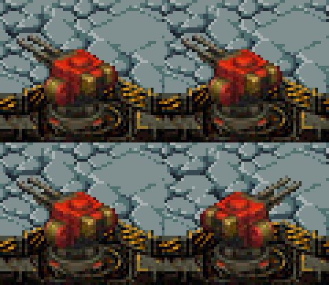

# Walkthrough: Hitbox Táctil Justa y Apuntado Persistente de la Batería

Sesión: `tap-hitbox-hold-aim` · Rama de trabajo: `feat/tap-hitbox-hold-aim` · Baseline: `full-incremental` @ `45f72b7`.

## 1. Resumen Ejecutivo

Dos correcciones en el motor ARM9, con evidencia A/B determinista en DeSmuME headless:

1. **Hitbox táctil anclada al sprite que se dibuja.** El tap ya no se resuelve contra un círculo fijo de 24 px centrado en el **punto lógico** del enemigo (sus pies), sino contra la **caja real del sprite dibujado** (con su `offset` de frame y su cota de vuelo), unida a un radio de gracia de 24 px alrededor del **centro del sprite**. Gana el enemigo más cercano. La región es una **unión**, así que nunca es más estricta que antes.
2. **La batería mantiene el apuntado.** Antes, tras disparar, cada cúpula volvía en pocos frames a su ángulo por defecto. Ahora **conserva la marcación de su último disparo** mientras no haya objetivo (nuevo campo `last_aim_angle`).

Además se **revoca** `DESIGN.md [OQ-06].4` («Filtro Táctil Estricto»), que nunca llegó a implementarse, para alinear el canon con el comportamiento real (disparo libre).

## 2. Antes vs Ahora

| Aspecto | Antes (baseline `45f72b7`) | Ahora |
| :--- | :--- | :--- |
| Resolución del tap | Círculo r=24 px centrado en el **punto lógico** (pies) | **Caja real del sprite** (offset de frame + cota de vuelo) **∪** radio r=24 px en el **centro del sprite**, con 6 px de margen |
| Enemigos con centro lógico `gy < 192` | **No seleccionables** (aunque su silueta asome) | Seleccionables si la caja intersecta la pantalla inferior |
| Unidades voladoras (`flight_altitude`) | El círculo se medía en el suelo, no donde se dibuja el sprite | La caja replica el desplazamiento de la cota de vuelo del render |
| Postura de la cúpula al cesar el objetivo | Vuelve al `default_angle` del socket | **Mantiene `last_aim_angle[s]`** (último disparo) |
| Init de ángulos | Hardcode `{0,2,2,4}` ≠ tabla `{0,1,3,4}` | Un solo origen: `c_wall_sockets[].default_angle` |
| Disparo a suelo vacío | Permitido (filtro inerte) | Permitido (canon alineado: `[OQ-06].4` revocado) |

## 3. Fix 1 — Hitbox táctil

**Qué hace ahora:** el tap se resuelve contra cada enemigo comprobando si el toque cae dentro de `caja(sprite) ⊕ 6 px` **o** dentro del radio de gracia de 24 px alrededor del centro del sprite; entre los candidatos gana el de centro más cercano al toque.

**Cómo está programado:**
- `include/enemy_data.h` / `source/enemy_data.c`: nuevo `enemy_get_frame_bounds(cx, cy, variant, frame, dir, is_attacking, out_x, out_y, out_w, out_h)`. Replica **exactamente** la selección de frame y la aritmética de offsets de la ruta de dibujo (`source_dir = clamp(dir-2,0,4)`, `frames`/`attack_frames`, y **`cy -= flight_altitude`** para unidades voladoras), pero **sin blitear**. Es la fuente única de verdad para «dónde está el sprite».
- `source/simulation.c`: en `game_handle_input_wave()` el bucle de selección usa `enemy_get_frame_bounds()` + `TAP_HIT_MARGIN` (6) + `TAP_HIT_RADIUS` (24).

**Por qué importaba `flight_altitude`:** la variante 0 (**Scourge**) es **voladora** con cota 10; su sprite se dibuja 10 px por encima del punto lógico. Un helper que ignorase la cota habría dejado la hitbox desplazada respecto a lo que se ve.

**Auditoría geométrica (`tools/hitbox_geometry.py`)** — píxeles de la silueta que quedaban **fuera** del círculo antiguo, por variante:

| Variante | Especie | Volador (cota) | Píxeles fuera del círculo viejo | Dist. máx. (px) |
| :---: | :--- | :---: | ---: | ---: |
| 0 | Scourge | sí (10) | 7 | 25.6 |
| 1 | Zergling | no | 19 | 26.9 |
| 2 | Hydralisk | no | 143 | 31.2 |
| 3 | Mutalisk | sí (14) | 1.886 | 57.8 |
| 4 | Defiler | no | 1.407 | 44.7 |
| 5 | Lurker | no | 1.825 | 46.1 |
| 6 | Guardian | sí (16) | 2.495 | 56.3 |
| 7 | Ultralisk | no | 4.015 | 58.1 |

Resultado: **8/8 variantes** tenían silueta fuera del círculo antiguo, en casos extremos hasta 58 px del centro. La región nueva (caja ∪ radio) **siempre** contiene la silueta dibujada y nunca es más estricta que la anterior.

## 4. Fix 2 — Apuntado persistente de la batería

**Qué pasaba:** al disparar, `wall_fire_at_target()` fijaba `turret_angles[s] = target_angles[s] = angle`. Pero al frame siguiente, `wall_update()` recalculaba `desired_angle = c_wall_sockets[s].default_angle` siempre que no hubiera objetivo, y el traverse motorizado devolvía la cúpula a su postura fija. De ahí el «dispara y se resetea».

**Cómo está ahora:**
```c
// wall_fire_at_target()
g_wall.last_aim_angle[s] = angle;           // recuerda la marcación

// wall_update(), sin objetivo:
int desired_angle = g_wall.last_aim_angle[s];   // en vez de default_angle
```
El snap instantáneo al disparar se conserva (la boca y el proyectil deben casar geométricamente). Nuevo campo `int last_aim_angle[4]` en `WallPlatform`, inicializado desde `c_wall_sockets[s].default_angle` — lo que además elimina la divergencia con el hardcode `{0,2,2,4}`.

## 5. Evidencia A/B (apuntado)

Escenario `scenarios/turret_hold_aim_test.json`, idéntico en ambas ROMs (arranque de oleada + disparo lateral). La región de la torreta se mide con `tools/ab_frame_diff.py pair` (rectángulo de la cúpula, x 0–60, y 308–360 en espacio cosido).

| Métrica | Baseline `45f72b7` (crc `3F2535A3`) | Nueva (crc `2AF89A56`) |
| :--- | ---: | ---: |
| Cúpula **antes de disparar** vs **al final** | **0 px** (volvió exactamente a reposo) | **771 px** (mantiene el rumbo) |
| Frame de disparo: baseline vs nueva | **0 px** (comportamiento idéntico hasta el disparo) | — |

La fila «frame de disparo» es el control: ambas ROMs son idénticas hasta el instante del disparo, así que la divergencia posterior es **puramente** el apuntado, sin confound de RNG.

Imagen recortada ×4 (fila 1: baseline; fila 2: nueva; columna 1: antes de disparar; columna 2: al final):



## 6. Escenarios y Regresión

- Nuevo: `scenarios/turret_hold_aim_test.json`.
- Build limpio: `scripts/build-project.ps1` → `DS_BUILD=PASS` (Docker BlocksDS), sin warnings.
- Baseline construido desde el commit **anterior** real (`full-incremental` @ `45f72b7`, árbol principal sin mis cambios), no desde HEAD.
- Herramientas nuevas (reutilizables): `tools/ab_frame_diff.py`, `tools/enemy_probe.py`, `tools/hitbox_geometry.py`, `tools/make_ab_image.py`.

## 7. Estado Honesto y Límites

- **Verificado en emulador (headless DeSmuME):** el apuntado persistente (A/B 0 px vs 771 px con control del frame de disparo) y la geometría de cobertura de la hitbox (auditoría estática sobre las definiciones de sprite reales).
- **No verificado como captura diferencial:** el A/B **funcional** de la hitbox. Para la variante 0 (el enemigo temprano más común) el círculo antiguo ya cubría casi toda la silueta (solo 7 px fuera), así que un tap diferencial con enemigos tempranos **no discrimina**. La evidencia de la hitbox es **geométrica**, y se declara como tal.
- **No verificado en hardware:** la sensación táctil real (pantalla resistiva) y los botones físicos. Los escenarios inyectan input por el *frontend* del emulador; la validación física queda pendiente en la DS.
- **Fuera de alcance (sin cambios):** la banda táctil de combate sigue siendo `py 14..169` (el canon dice `Y_local 0..143`); no se ha tocado la cadencia (verificado que ya era plana) ni el camino legacy `g_turrets` (inerte).

## 8. Ficheros Modificados

- `include/enemy_data.h`, `source/enemy_data.c` — `enemy_get_frame_bounds()` (caja del sprite sin blit, con cota de vuelo).
- `include/game.h` — campo `last_aim_angle[4]` en `WallPlatform`.
- `source/simulation.c` — hitbox por caja ∪ radio en `game_handle_input_wave()`; `last_aim_angle` en `wall_fire_at_target()` y `wall_update()`; init unificado desde la tabla de sockets.
- `tools/ab_frame_diff.py`, `tools/enemy_probe.py`, `tools/hitbox_geometry.py`, `tools/make_ab_image.py` — medición/evidencia reutilizable.
- `scenarios/turret_hold_aim_test.json` — escenario de la evidencia A/B.
- `DESIGN.md` (`[OQ-06].4` revocado, `[OQ-06].1`, `[OQ-11]` nuevo, §1 y §11.B), `TECHNICAL.md` (§5 invariantes, §6, §8), `STATUS.md`, `AGENTS.md` (convención de worktrees dentro de `.worktrees/`) — coherencia documental.
